[TOC]

# 文件概述

主要目的在說明「Studio A EC平台」(以下簡稱本系統 )之需求分析，以提供未來確認需求、軟體測試規劃及軟體建置開發的依據。

# 需求架構

本系統主要分為前台(即消費者端所接觸到之功能)及後台(即管理者所管理本系統所需之功能)；其中，後台又分為兩個部分，第一部分為供應商後台，第二部分為Studio A EC管理後台(以下簡稱SA管理後台)。

**前台 / 消費者端網站及APP**：消費者/會員所見頁面屬於前台/消費者端功能。

**供應商後台**：提供廠商可自主管理商品、訂單等功能。

**Studio A管理後台**：總管全站包含商品、訂單、會員、供應商、EC前台外觀等功能。

# 功能描述

## 會員帳號

會員帳號功能主要提供會員註冊、會員登入、忘記密碼及修改密碼功能。

### 註冊

1. 提供會員透過手機號碼驗證方式註冊為EC會員。
2. 提供會員透過手機號碼綁定原Studio A會員至EC會員。

### 登入

1. 可使用前述註冊之會員帳號登入本系統。
2. 如有綁定第三方登入者，可透過第三方登入方式登入本系統。

### 第三方登入綁定

1. 規劃每位會員可綁定一組Facebook帳戶及一組Google帳戶。
2. 綁定第三方登入需先註冊成為本站會員後，方可進行綁定。
3. 綁定所需之Facebook及Google相關設定帳號由Studio A提供。

### 忘記密碼

1. 若會員因忘記密碼而無法登入本系統，可使用此功能進行重設密碼。
2. 會員需輸入手機號碼索取驗證碼後，方可於本站進行重設密碼，重設完畢後，舊密碼立即失效。
3. 重設密碼後，可使用新的密碼登入本系統。

## 會員紅利點數

會員可於本系統查詢總點數、查詢點數明細以及使用點數。點數資訊由於需結合線上及線下點數，因此主要計算機制維持在EPB計算。

1. **查詢點數**：會員可於前台查詢目前擁有紅利點數 (EPB點數查詢API)。
2. **查詢點數紀錄**：會員可於前台查詢紅利點數歷史紀錄(最多27個月) (EPB點數紀錄查詢API)。
3. **結帳點數查詢**：會員於結帳時可同步看到目前可折抵點數，並且使用此點數折抵部分金額 (EPB點數查詢API)。
4. **結帳點數折抵**：會員結帳時可使用紅利點數折抵整筆訂單一定比例金額，此比例%依據百分比在管理後台設定 (透過訂單API傳回EPB進行折抵)。
4. **線上訂單累積點數**：透過訂單API傳回EPB，EPB根據訂單資訊計算累積點數。
6. **線上訂單退貨扣除點數**：透過訂單API傳回銷退至EPB，EPB根據訂單銷退資訊計算扣回點數。
7. **結帳點數折抵設定**：於管理後台可依據會員等級設定結帳點數折抵上限百分比%。

## 訂單

### 訂單流程

會員下單後，須立即完成結帳動作後(ATM付款者則為付款完成後)，才會轉為訂單成立狀態，此時即觸發系統開立發票(1張訂單開立1張發票)，完成開立發票後，隨即傳送該筆訂單資訊至EPB留存紀錄。接著，SA人員才會開始進行出貨作業，出貨則可能是單筆或分批(多筆)出貨。

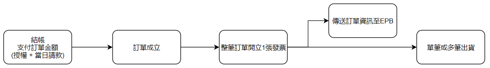

### 出貨作業

出貨部分則由SA產生撿貨單、出貨單後，進行出貨處理作業，接著若為主機商品，則需輸入主機IMEI序號留存於本系統，非主機商品則無需做此動作；接著輸入物流單號進行物流叫件，一般出貨主要以黑貓為主，若為黑貓叫件則本系統將透過API呼叫黑貓進行叫件及物流狀態更新；若非黑貓叫件者，則本系統不負責呼叫API叫件，僅提供物流商及物流單號紀錄功能。

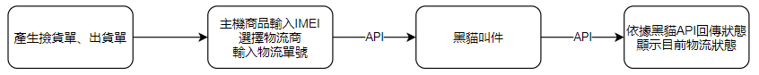

**前台訂單狀態及按鈕顯示**

前台會員所見之訂單狀態依據當下所執行到的步驟而定，詳細如下圖說明。

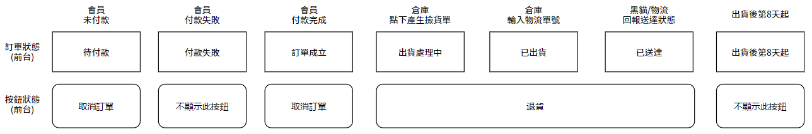

### 取消訂單流程

會員可於商品尚未進入撿貨階段取消訂單，取消訂單無須經過SA管理者審核，由系統自動執行取消及退款作業；唯獨無法執行線上自動退款者(ATM)依然需由SA手動退款 (如ATM尚未付款者亦由系統自動取消訂單)。

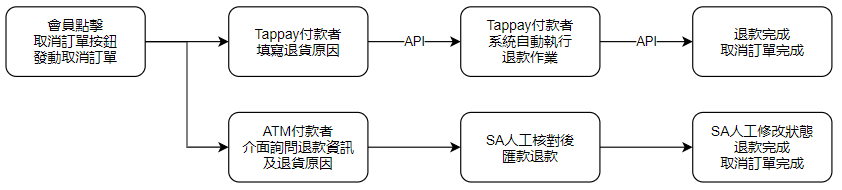

### 退貨流程

會員可於撿貨後直到7天鑑賞期截止前辦理退貨作業 (SA管理後台則不受限，隨時皆可退貨)，會員須填寫退貨原因(ATM付款者須另外填寫退款資訊表單以利手動退款作業)。

SA人員則於收到退貨需求後開始處理，首先執行逆物流派車收回商品，待商品抵達倉庫後，則進行檢驗，檢驗後勾選退貨項目、確認可退款金額、是否加收補收單後，由財快人員確認款項無誤，則進行退款作業，同樣若非ATM訂單則自動退款、ATM訂單則由SA人員手動退款後，手動修改系統退款狀態完成退貨作業。

本系統於整段退貨作業皆執行完畢(已退款狀態)時，透過API回傳訂單銷退資料至EPB。

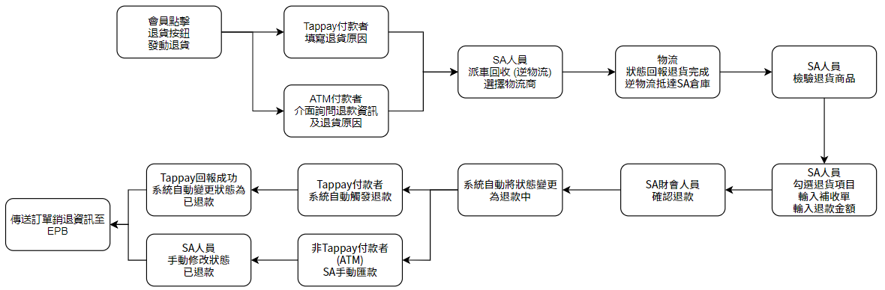

**前台訂單退貨狀態**

前台會員所見之訂單退貨狀態依據當下所執行到的步驟而定，詳細如下圖說明。

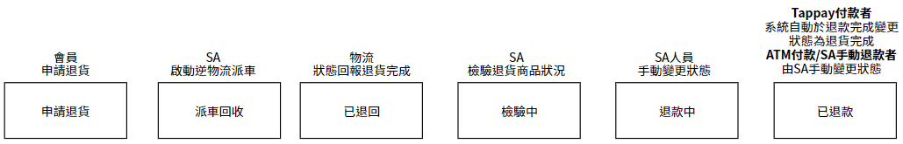

### 補收單

補收單為會員退貨時，若有相關費用需被額外收取，則使用此功能從退款金額中補收。

**補收項目**：運費、贈品、包裝/整新費、活動/折扣價差、已出貨/缺少商品

**補收金額**：由SA管理者自行填寫金額。

**會員端呈現**：與退貨資訊一起呈現，顯示補收項目 + 金額。

**EC透過API回傳至EPB之訂單資訊列表**：

- TM為訂單母單號、TS為訂單子單號。
- 每條TS數量皆為1，如同一商品訂購多個數量，則會有多條數量為1的TS。

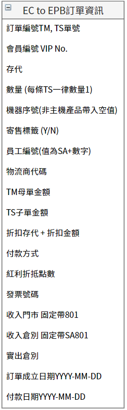

**支付透過Tappay支付流程**

## 商品

商品檔分為本系統(EC)商品檔及EPB商品檔。

**EC商品檔**：本系統之各項功能操作皆使用此商品檔，KEY值為商品編號。

**EPB商品檔**：由EPB透過中間表同步至EC的商品檔，EC僅取用部分欄位做為EC商品檔之資料源，本系統各項功能無法直接使用EPB商品檔操作。

**商品管理及資料同步流程**：

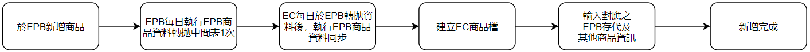

**EPB商品檔欄位**

此為EPB商品檔原始資料欄位中英文名稱。

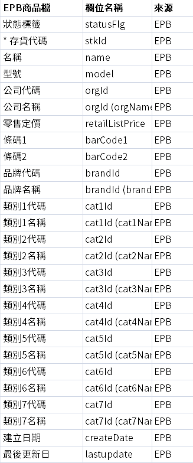

**更新售價**

由於本系統商品檔售價來源為EPB且不開放人工修改該欄位價格，因此系統每日同步資料後，採依序批次更新方式將售價更新。

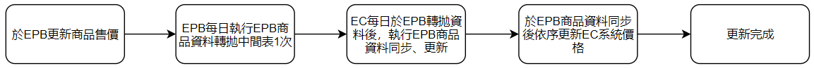

新增商品：新增一檔EC商品，選擇對應EPB商品檔後，依序輸入下列欄位資訊，商品檔為操作本系統各項功能之基礎，需先建立商品檔後才可運用商品檔設定其他功能，例如促銷、主題活動等。

#### 多規格商品

多規格商品為一商品有多種不同規格(顏色、容量等)之商品，舉例來說，iPhone 12在規格上有多種顏色及容量，且EPB存代亦不同，但皆須呈現在同一個EC商品頁上，因此須設定多規格商品來將一個EC商品對應多種規格、多個存代及多種價格。

| EC商品頁         | EPB存代 (非真實存代, 僅做為舉例) | 商品      | 規格       | 售價  |
| ---------------- | -------------------------------- | --------- | ---------- | ----- |
| iPhone 12 商品頁 | 10001                            | iPhone 12 | 藍色 128G  | 22000 |
| iPhone 12 商品頁 | 10002                            | iPhone 12 | 藍色 256G  | 25000 |
| iPhone 12 商品頁 | 10003                            | iPhone 12 | 藍色 512G  | 28000 |
| iPhone 12 商品頁 | 10004                            | iPhone 12 | 銀色 128G  | 22000 |
| iPhone 12 商品頁 | 10005                            | iPhone 12 | 銀色 2568G | 25000 |
| iPhone 12 商品頁 | 10006                            | iPhone 12 | 銀色 512G  | 28000 |

#### 組合商品

組合商品為超過一種不同種類的EPB商品組成一個EC商品以利綑綁銷售，組合商品與多規格商品不同之處為組合商品僅有一個售價且所有商品綑綁銷售，而非獨立讓消費者選購，舉例來說，iPhone 12 Pro 新機優惠組合包，內含主機、保護貼及保護殼，整包販售27999元。

| EC商品頁                     | EPB存代 (非真實存代, 僅做為舉例) | 商品          | 規格          |
| ---------------------------- | -------------------------------- | ------------- | ------------- |
| iPhone 12 Pro 新機優惠組合包 | 2001                             | iPhone 12 Pro | 紅色 256G     |
| iPhone 12 Pro 新機優惠組合包 | 2002                             | 玻璃保護貼    | iPhone 12 Pro |
| iPhone 12 Pro 新機優惠組合包 | 2003                             | 犀牛頓保護殼  | iPhone 12 Pro |
|                              |                                  |               | 售價：27999   |

#### 序號商品

- 序號商品一旦經過配送後，便不接受退貨，因此無退貨按鈕。
- 序號商品管理同一般商品，僅庫存管理部分不同，描述如下。
- 會員可於訂單頁面自行點擊重新發送序號信件。

**序號商品庫存管理**

- 序號商品除原本庫存數量外，需上傳未拆封序號至商品庫存區。
- 上傳序號需求為透過csv檔上傳序號(補貨)。
- 自動配貨時，系統將自動取用並標記序號庫存區序號。

**KKOBX一般**

- 一般類序號型商品流程與一般商品雷同，唯出貨部分為系統自動出貨，出貨方式為系統自動從資料庫中取用一組未被發送過的序號，並將該組序號透過Email的形式配送至訂購者Email信箱中。

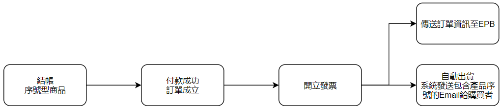

**KKOBX教育優惠**

- 序號商品教育優惠步驟與Apple教育優惠商品相同，但不需edu信箱驗證程序。
- SA管理者於後台進行驗證資料後，若審核通過則系統自動出貨，發送序號Email至購買者信箱。

**宜睿**

- 宜睿禮券結帳與付款流程同一般商品，唯出貨是由系統自動出貨至會員Wallet中的票夾。
- 取券透過宜睿API進行。

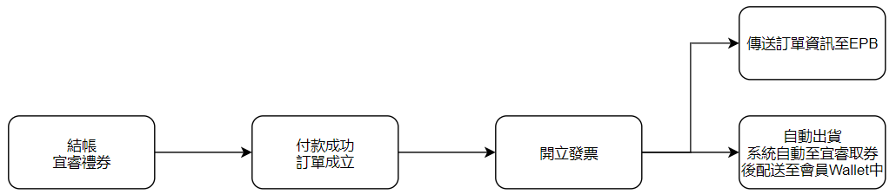

### 分類管理

1. 自定義商品分類，並設定下列資料。
2. 同一商品可上架於一個或多個分類。

| 欄位        | 說明                           | 必填 |      |
| ----------- | ------------------------------ | ---- | ---- |
| 分類名稱    | 此分類顯示的名稱               | Y    |      |
| Banner      | 分類頁上的Banner圖，上限五張圖 | Y    |      |
| 商品        | 需陳列在此分類的商品           | N    |      |
| Title       | 此分類的SEO title              | N    |      |
| Description | 此分類的SEO description        | N    |      |
| Keyword     | 此分類的SEO keyword            | N    |      |
|             |                                |      |      |

#### 固定分類 - 教育優惠

此分類為公開所有人皆可閱覽之固定分類，此分類僅上架提供教育優惠之商品，並且需要進行身分驗證流程。

1. 本分類所使用價格皆為教育價欄位。
2. 本分類下的商品原訂單結帳流程外，還需要額外填寫資料、上傳證件及通過審核。
3. 如最終通過審核則直接出貨。
4. 如最終未通過審核則由SA人員手動觸發取消訂單。
5. 教育優惠發票不可開立統編。

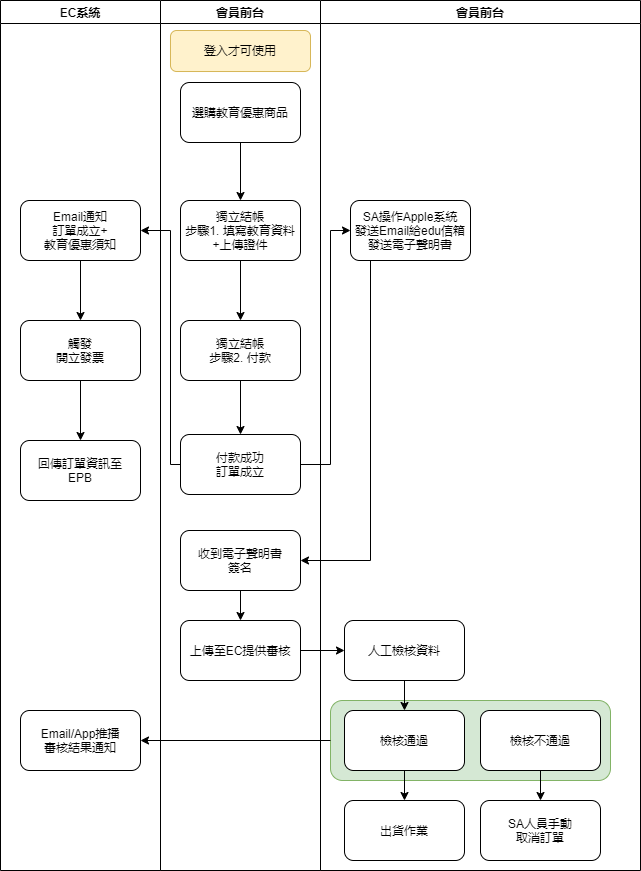

#### 固定分類 - 隱形賣場

隱形賣場為一個只有指定等級會員才可以看到的賣場，管理者可針對各等級需求加入或移除商品至該等級的隱形賣場品類中。

| 會員等級    | 是否有隱形賣場功能 | 隱形賣場能見度                 |      |
| ----------- | ------------------ | ------------------------------ | ---- |
| 鑽石會員    | 有                 | 僅鑽石會員登入後可見到該賣場   |      |
| 白金會員    | 有                 | 僅白金會員登入後可見到該賣場   |      |
| 標準會員    | 有                 | 僅標準會員登入後可見到該賣場   |      |
| 集點卡會員  | 有                 | 僅集點卡會員登入後可見到該賣場 |      |
| 員工        | 有                 | 僅員工登入後可見到該賣場       |      |
| 未登入/訪客 | 無                 | 無                             |      |

### 庫存管理

可針對已建立好的商品統一進行庫存管理。

1. 需先建立商品才可於庫存管理中管理該商品庫存。
2. 庫存倉庫機制為虛擬倉，管理者調整庫存數量後，系統便會認定該數量為目前可販售庫存。
3. 可針對商品/加購品/贈品/序號進行補貨。
4. 庫存低於3個時系統發送通知給管理者告警。

**虛擬倉別表**

|虛擬倉         |適用訂單     |地址               |
|------------|---------|-----------------|
|STUDIO A EC倉|EC所有訂單   |台北市中山區八德路二段260號  |
|供應商倉        |所有供應商出貨訂單|供應商填寫地址          |
|客服倉         |無        |無                |
|海洋大學        |僅限EC快送訂單 |基隆市中正區北寧路2號      |
|清華大學        |僅限EC快送訂單 |新竹市光復路二段101號     |
|亞洲大學        |僅限EC快送訂單 |台中市霧峰區柳豐路500號    |
|東海大學        |僅限EC快送訂單 |台中市西屯區臺灣大道四段1727號|
|文化大學        |僅限EC快送訂單 |台北市士林區華岡路55號     |
|政治大學        |僅限EC快送訂單 |台北市文山區指南路二段64號   |
|台北大學        |僅限EC快送訂單 |新北市三峽區大學路151號    |
|淡江大學        |僅限EC快送訂單 |新北市淡水區英專路151號    |
|成功大學        |僅限EC快送訂單 |台南市東區勝利路118號     |
|逢甲大學        |僅限EC快送訂單 |台中市西屯區文華路100號    |
|高雄師範大學      |僅限EC快送訂單 |高雄市苓雅區和平一路116號   |
|中興大學        |僅限EC快送訂單 |台中市南區國光路250號     |
|輔仁大學        |僅限EC快送訂單 |新北市新莊區中正路510號    |
|中央大學        |僅限EC快送訂單 |桃園市中壢區五權里中大路300號 |
|大安門市        |僅限EC快送訂單 |台北市大安區忠孝東路四段98號  |
|阿波羅門市       |僅限EC快送訂單 |台北市大安區忠孝東路四段218號 |
|新西門         |僅限EC快送訂單 |台北市萬華區峨嵋街43號     |
|士林門市        |僅限EC快送訂單 |台北市士林區文林路138號    |
|高島屋門市       |僅限EC快送訂單 |台北市士林區忠誠路二段55號   |
|永和門市        |僅限EC快送訂單 |新北市永和區永和路1段174號  |
|站前維修中心      |僅限EC快送訂單 |台北市南陽街1號         |
|桃園統領        |僅限EC快送訂單 |桃園市桃園區中正路61號     |
|新竹中正門市      |僅限EC快送訂單 |新竹市東區中正路28號      |
|新竹光復        |僅限EC快送訂單 |新竹市光復路2段198號     |
|苗栗尚順門市      |僅限EC快送訂單 |苗栗縣頭份鎮中央路105號    |
|台中中科門市      |僅限EC快送訂單 |台中市西屯區永福路136號    |
|台中精誠門市      |僅限EC快送訂單 |台中市西屯區精誠路48號     |
|台中彩虹        |僅限EC快送訂單 |台中市英才路474號       |
|台中公益維修中心    |僅限EC快送訂單 |台中市西區公益路151號     |
|台南大億西門門市    |僅限EC快送訂單 |台南市南區西門路1段653號   |
|高雄三多門市      |僅限EC快送訂單 |高雄市苓雅區三多三路254號   |
|高雄大統門市      |僅限EC快送訂單 |高雄市新興區五福2路262號   |
|花蓮門市        |僅限EC快送訂單 |花蓮市中山路172號       |
|羅東門市        |僅限EC快送訂單 |宜蘭縣羅東鎮興東路10號     |
|大立門市        |僅限EC快送訂單 |高雄市前金區五福3路57號    |
|微風門市        |僅限EC快送訂單 |台北市松山區復興南路1段39號  |
|美麗華門市       |僅限EC快送訂單 |台北市中山區敬業三路20號    |
|板橋誠品門市      |僅限EC快送訂單 |新北市板橋區中山路一段46號   |
|夢時代門市       |僅限EC快送訂單 |高雄市前鎮區中華五路789號   |
|新竹遠百門市      |僅限EC快送訂單 |新竹市西大路323號8號     |
|中壢大江門市      |僅限EC快送訂單 |桃園市中壢區中園路二段501號  |
|桃園台茂門市      |僅限EC快送訂單 |桃園市蘆竹區南崁路一段112號  |
|台中豐原太平洋門市   |僅限EC快送訂單 |台中市豐原區復興路2號1樓    |
|板橋遠百門市      |僅限EC快送訂單 |新北市板橋區中山路一段152號  |
|新莊宏匯        |僅限EC快送訂單 |新北市新莊區新北大道四段3號   |

## 主題活動

### VIP活動

針對VIP會員所推出的活動，會員登入後才可以看到活動。

**活動設定**：

| 欄位         | 說明                                        | 必填 |      |
| ------------ | ------------------------------------------- | ---- | ---- |
| 活動名稱     | 此活動名稱                                  | Y    |      |
| Banner       | 活動頁上的Banner圖，上限五張圖              | Y    |      |
| 活動說明     | 文字編輯器                                  | Y    |      |
| 指定會員等級 | 全選 / 鑽石 / 白金 / 標準 / 集點卡 (可複選) | Y    |      |
| 商品         | 需陳列在此活動頁上的商品                    | Y    |      |
| 上下架日期   | 此活動的上下架日期                          | Y    |      |

### 全站活動

公開且不限定會員等級的活動。

**活動設定**：

| 欄位       | 說明                           | 必填 |      |
| ---------- | ------------------------------ | ---- | ---- |
| 活動名稱   | 此活動名稱                     | Y    |      |
| Banner     | 活動頁上的Banner圖，上限五張圖 | Y    |      |
| 活動說明   | 文字編輯器                     | Y    |      |
| 商品       | 需陳列在此活動頁上的商品       | Y    |      |
| 上下架日期 | 此活動的上下架日期             | Y    |      |

## 促銷

### 折價券

| 設定項目     | 說明                                                         |      |      |      |
| ------------ | ------------------------------------------------------------ | ---- | ---- | ---- |
| 折價券識別碼 | 此為系統產生之券號                                           |      |      |      |
| 折價券名稱   | 前後台顯示名稱                                               |      |      |      |
| 活動說明     | 文字編輯器，顯示於消費者前台折價券內頁                       |      |      |      |
| 條款         | 文字編輯器，顯示於消費者前台折價券內頁                       |      |      |      |
| 發放條件     | 特定區間EC消費累積滿額、EC單筆消費滿額 購買指定單品 / 分類 輸入指定名單 輸入兌換碼 |      |      |      |
| 領取方式     | 官網 / APP (複選)                                            |      |      |      |
| 領取期限     | 日期區間                                                     |      |      |      |
| 使用期限     | 日期區間 / 與領取期限相同                                    |      |      |      |
| 折扣類型     | 折現：可折抵訂單金額。 打折：可針對訂單金額打折。 上課券：可折抵課程金額。 技術服務券：可免費取得技術諮詢服務。 贈品券：可兌換贈品。 (單選) |      |      |      |
| 折扣設定     | 折現：設定面額, 可發放數量上限。  打折：設定打折%數, 可發放數量上限。 上課券：每張固定折500元，設定符合發放條件發幾張給會員, 可發放數量上限(可不設限)。 技術服務券：無折價金額，設定符合發放條件發幾張給會員, 可發放數量上限(可不設限)。 贈品券：設定取得券後可兌換單品, 可發放數量上限。 |      |      |      |
| 適用商品     | 限定分類 / 單品 排除分類 / 單品 全館適用           |      |      |      |
| 適用通路     | 線上 / 門市 (複選)                                           |      |      |      |
| 使用條件     | 不限 滿額門檻：設定一滿額門檻金額，訂單需符合此門檻才可使用本券。 最高可折抵金額：整張訂單的一定比例% / 固定金額 |      |      |      |
| 存貨代碼     | 自行輸入EPB對應的存代，訂單使用折扣時將帶入此存貨代碼至API回傳EPB |      |      |      |

- **折價券統計**
  - 已發放數量/面額總額
  - 已領取數量/面額總額
  - 已使用數量/面額總額
  - 使用率
  - 折價券使用訂單消費額加總

### 加價購

- **商品頁加價購**：
  - 顯示於商品頁。
  - 設定方式：可以by單個商品設定、by商品分類設定(即適用該分類下的所有商品頁)。
  - 顯示優先順序為：優先顯示單品設定上的加價購、若無資料才可顯示商類商品的加價購，若都無資料則不顯示加價購。
  - **設定**：
    - 加價購折扣：設定該商品加價購的折扣金額。
    - 加價購售價：EPB售價 - 加價購折扣即等於加價購售價。
    - 加價購上下架時間：加價購商品於前台上下架的時間。
    - 加價購數量：加價購商品可被加購的庫存總數。
    - 加價購限額：該加價購商品可選購的數量上限。
- **全站加價購**：
  - 顯示於購物車，全站各等級會員通用。
  - **設定：**
    - 加價購上下架時間：加價購商品於前台上下架的時間。
    - 加價購數量：加價購商品可被加購的庫存總數。
    - 加價購限量：該加價購商品可購買的單品數量上限。

### 滿額贈品

滿足設定條件後可得到免費贈品。

| 設定項目                     | 選項                                                         |      |
| ---------------------------- | ------------------------------------------------------------ | ---- |
| 指定商品條件                 | 指定全館 / 分類 / 單品 排除分類 / 單品                  |      |
| 必購商品                     | 是：需選擇一樣單品，條件為滿足此項條件及上一個項目 否   |      |
| 活動階段、滿額門檻及贈品設定 | 單階活動：如買1000就送贈品 多階活動(上限3階)：如買1000就送A贈品、滿2000送A+B贈品 |      |
| 多階活動選項                 | 可累計 / 不可累計金額                                        |      |
| 優惠日期區間 (上下架日期)    | 此優惠適用的時間                                             |      |
| 限定會員等級                 | 全選 / 鑽石 / 白金 / 標準 / 集點卡 (可複選)                  |      |
| 其他限定條件                 | 指定物流方式 指定支付方式 是否可與折價券並用       |      |

**贈品檔設定**：

| 欄位       | 說明                                       |      |
| ---------- | ------------------------------------------ | ---- |
| 贈品名稱   | 前台顯示贈品名稱                           |      |
| 存代       | 贈品對應EPB存代                            |      |
| 圖片       | 贈品圖片                                   |      |
| 特色       | 贈品簡短特色說明                           |      |
| 庫存       | 可設定數字或是無限，倉別有EC倉及各個門市倉 |      |
| 上下架時間 | 輸入時間區間                               |      |
| 啟用狀態   | 開啟/關閉                                  |      |

1. 贈品檔若庫存=0時發送警示給SA管理者。
2. 預約不適用滿額贈。
3. 贈品價格於結帳訂單上採用折扣方式折價，例如贈品EPB售價100元則給負向金額做為折扣-100，相加等於0元。

### 滿額折扣

滿足設定條件後可得到折扣。

| 設定項目                     | 選項                                                         |      |
| ---------------------------- | ------------------------------------------------------------ | ---- |
| 指定商品條件                 | 指定全館 / 分類 / 單品 排除分類 / 單品                  |      |
| 必購商品                     | 是：需選擇一樣單品，條件為滿足此項條件及上一個項目 否   |      |
| 活動階段、滿額門檻及折扣設定 | 單階活動：如買1000就折扣 多階活動(上限3階)：如買1000就折扣、滿2000就折扣 折扣方式：折扣指定金額(輸入 -xx 元)、折扣率(- xx% 輸入) |      |
| 多階活動選項                 | 可累計 / 不可累計金額                                        |      |
| 優惠日期區間(上下架日期)     | 此優惠適用的時間                                             |      |
| 限定會員等級                 | 全選 / 鑽石 / 白金 / 標準 / 集點卡 (可複選)                  |      |
| 其他限定條件                 | 指定物流方式 指定支付方式 是否可與折價券並用       |      |

### 任選優惠

- 快送專區商品不適用此優惠。
- 組合商品不適用此優惠。
- 計算優惠、折扣時，採無條件捨去，例如算出某商品可以折26.3，則最終可折26元。
- 退貨部分，系統需保留手動的機制，介面上需要針對促銷訂單品項提供勾選要退掉哪一筆商品/折扣的功能。

#### A+B

1. 會員需於A區及B區**都**挑選商品後，才可符合下列條件設定優惠。
2. 如不成對，例如A區選兩個B區選一個或相反，優先選單價較高的進行折價運算。

| 設定項目             | 選項                                                         |      |
| -------------------- | ------------------------------------------------------------ | ---- |
| 活動名稱             | 本次活動名稱，上限50字                                       |      |
| 活動時間(上下架日期) | 此優惠適用的時間                                             |      |
| 活動主圖             | 上限五張圖                                                   |      |
| 活動說明             | 文字編輯器                                                   |      |
| A區顯示名稱          | 前台A區名稱                                                  |      |
| 指定A區商品          | 指定分類 / 商品                                              |      |
| B區顯示名稱          | 前台B區名稱                                                  |      |
| 指定B區商品          | 指定分類 / 商品                                              |      |
| 優惠方式             | 固定價：A+B商品成對時可有一個固定優惠價，A/B區商品各設定一個固定價，例如：A區=99, B區=51, A+B固定價150 打折：A+B商品成對時可打折 |      |
| 限定會員等級         | 全選 / 鑽石 / 白金 / 標準 / 集點卡 (可複選)                  |      |
| 其他限定條件         | 指定物流方式 指定支付方式 是否可與折價券並用       |      |

- **A+B特價150元送回EPB範例**：
  - TM 此訂單結帳總金額 150元
  - TS1 A區商品R1 原價150元
  - TS2 B區商品G1 原價60元
  - TS3 R1存代, 99-150=-51 (A區商品折扣金額)
  - TS4 G1存代, 51-60=-9 (B區商品折扣金額)

- **A+B打九折送回EPB範例**：

  - TM 此訂單結帳總金額 270元
  - TS1 A區商品R1 原價100元
  - TS2 B區商品G1 原價200元
  - TS3 R1存代, 100*(0.9-1)=-10 (A區商品折扣金額)
  - TS4 G1存代, 200*(0.9-1)=-20 (B區商品折扣金額)

#### 任選N件折

在該活動區內的商品，不限制同一個商品，任選N件即可適用本優惠活動。

| 設定項目                     | 選項                                                         |      |
| ---------------------------- | ------------------------------------------------------------ | ---- |
| 活動名稱                     | 本次活動名稱，上限50字                                       |      |
| 活動時間(上下架日期)         | 此優惠適用的時間                                             |      |
| 活動主圖                     | 上限五張圖                                                   |      |
| 活動說明                     | 文字編輯器                                                   |      |
| 任選N件商品列表              | 指定分類 / 商品                                              |      |
| 優惠方式                     | **任選N件固定價**：達成條件後，就適用該固定價格；例如滿三件399。 **任選N件折扣**：達成條件後，就提供折扣；例如滿三件9折。 |      |
| 活動階段、滿額門檻及折扣設定 | **固定價** 第一階：輸入滿XX件，總價XXX元 (必填) 第二階：輸入滿XX件，總價XXX元 (非必填) 第三階(上限3階)：輸入滿XX件，總價XXX元 (非必填) **折扣** 第一階：輸入滿XX件，打折%數 (必填) 第二階：輸入滿XX件，打折%數 (非必填) 第三階(上限3階)：輸入滿XX件，打折%數 (非必填) |      |
| 限定會員等級                 | 全選 / 鑽石 / 白金 / 標準 / 集點卡 (可複選)                  |      |
| 其他限定條件                 | 指定物流方式 指定支付方式 是否可與折價券並用       |      |

**任選N件固定價範例**：

- 任選N件固定價，三件599、四件699

- 算式應為（699-(260+250+230+220)）/4 = -66、-65、-65、-65

- 同一商品第N件折扣，應可至少設到3階

- 三件599、四件699

- 消費者買了A1, A2, A3, A4, A5五個商品都符合條件

- A1 200元

- A2 250元

- A3 230元

- A4 220元

- A5 260元

- 依照價高者優先折，因五個商品適用4件699的方案。

- 送EPB明細如下：

  - TM 899元
  - TS1 A5 260元
  - TS2 A2 250元
  - TS3 A3 230元
  - TS4 A4 220元
  - TS5 A1 200元
  - TS6 A5存代,(699/4)-260=175-260=-85
  - TS7 A2存代,(699/4)-250=175-250=-75
  - TS8 A3存代 (699/4)-230=175-230=-55
  - TS9 A4存代 (699/4)-220=174-220=-46

**任選N件折扣範例**：

- 三件9折、六件85折
  - 消費者買了A1, A2, A3, A4, A5五個商品都符合條件
    - A1 200元
    - A2 250元
    - A3 230元
    - A4 220元
    - A5 260元
  - 依照價高者優先折，因五個商品故只適用三件9折，因此A5, A2, A3各打9折。
  - 送EPB明細如下：
    - TM 1086元
    - TS1 A5 260元
    - TS2 A2 250元
    - TS3 A3 230元
    - TS4 A5存代, 260*(0.9-1)=26
    - TS5 A2存代, 250*(0.9-1)=25
    - TS6 A3存代, 230*(0.9-1)=23
    - TS7 A4 220元
    - TS8 A1 200元

#### 第N件折

在該活動區內的商品，限制同一商品，第N件即可適用本優惠活動。

| 設定項目                     | 選項                                                         |      |
| ---------------------------- | ------------------------------------------------------------ | ---- |
| 活動名稱                     | 本次活動名稱，上限50字                                       |      |
| 活動時間(上下架日期)         | 此優惠適用的時間                                             |      |
| 活動主圖                     | 上限五張圖                                                   |      |
| 活動說明                     | 文字編輯器                                                   |      |
| 任選N件商品列表              | 指定分類 / 商品                                              |      |
| 優惠方式                     | **第N件折價**：一張訂單購買第N件，可折XXX元。 **第N件折扣**：一張訂單購買第N件，可打XX%折。 |      |
| 活動階段、滿額門檻及折扣設定 | **第N件折價**：輸入第XX件，折扣XXX元 **第N件折扣**：輸入第XX件，打折%數 |      |
| 限定會員等級                 | 全選 / 鑽石 / 白金 / 標準 / 集點卡 (可複選)                  |      |
| 其他限定條件                 | 指定物流方式 指定支付方式 是否可與折價券並用       |      |

**同一商品第N件折扣**

  - 設定第幾(N)件有折扣/折價/固定價

  - 指定適用的會員等級

  - 指定適用同一商品, 第N件折扣的商品 => 商品, 品類

  - 上架區間

  - 可否與折價券並用

**第N件固定價案例：第三件50元**

  - 購買A1 100元 數量4
  - 購買A2 150元 數量4
  - 則訂單折價為A1可得到其中一個變成50元、A2可得到其中一個變成50元
  - 送回EPB如下：
  - TM 850元
  - TS1 A1 100元
  - TS2 A1 100元
  - TS3 A1 100元
  - TS4 A1 100元
  - TS5 A2 150元
  - TS6 A2 150元
  - TS7 A2 150元
  - TS8 A2 150元
  - TS9 A1存代, 50-100=-50
  - TS10 A2存代, 50-150=-100

**第N件折價案例：第三件折50元**    

- 如數量為6個，則可得到兩套優惠，折2次50元。

  - A1 100元買6個
  - A2 150元買4個
  - 則A1可得到2個折50元、A2可得到1個折50元。
  - 送回EPB如下：
  - TM 1050元
  - TS1 A1 100元
  - TS2 A1 100元
  - TS3 A1 100元
  - TS4 A1 100元
  - TS5 A1 100元
  - TS6 A1 100元
  - TS7 A2 150元
  - TS8 A2 150元
  - TS9 A2 150元
  - TS10 A2 150元
  - TS11 A1存代, -50
  - TS12 A1存代, -50
  - TS13 A2存代, -50

**折價案例：第二件折100元**

 - A1 100元買3個
 - A2 150元買4個
 - 則A1可得到1個折100、A2可得到兩個折100。
 - 送回EPB如下：
 - TM 600元
 - TS1 A1 100元
 - TS2 A1 100元
 - TS3 A1 100元
 - TS4 A1 150元
 - TS5 A2 150元
 - TS6 A2 150元
 - TS7 A2 150元
 - TS8 A1存代, -100
 - TS9 A2存代, -100
 - TS10 A2存代, -100

**折扣案例：第二件打8折**

 - A1 100元買3個
 - A2 150元買4個
 - 則A1可得到1個打8折、A2可得到兩個打8折。
 - 送回EPB如下：
 - TM 820元
 - TS1 A1 100元
 - TS2 A1 100元
 - TS3 A1 100元
 - TS4 A1 150元
 - TS5 A2 150元
 - TS6 A2 150元
 - TS7 A2 150元
 - TS8 A1存代, 100*(0.8-1)=-20
 - TS9 A2存代, 150*(0.8-1)=-30
 - TS10 A2存代, 150*(0.8-1)=-30

### 限時

- 可針對商品設定可購買時間(即限時內才可購買)，若會員於此時間區間外，則無法購買(如商品仍在架上，依然可以瀏覽)。
- 上下架時間區間須大於等於可購買時間區間。

### 限量

- 可針對商品設定每位會員帳號可購買總數量
- 如同一商品有多種規格，同一商品的各規格數量皆累計在一起(例如：iPhone12商品檔有兩個規格128G及256G，上限2隻則這兩個規格總數加起來上限為2隻)

### 免運設定

- 全站無論分類、商品一致免運邏輯
- 可設定項目：整單免運金額

## 快送

快送即快送配送，預計2小時內將訂購商品透過機車快遞Lalamove送抵會員地址。

1. 快送區為獨立一個分類，會員進入此分類需先透過會員所輸入之地區判斷是否位於快送服務區內，如符合則可開始選購快送商品；如不符合則無法進行選購。
2. 會員購物車內之快送商品將獨立呈現於購物車中的快送專區內，會員可選擇單筆或多筆快送商品進行結帳。
3. 快送訂單配送方式一律使用Lalamove進行配送。
4. 快送訂單一律不開放ATM付款。
5. 快送訂單退貨比照一般訂單處理。

會員前台部分流程圖：

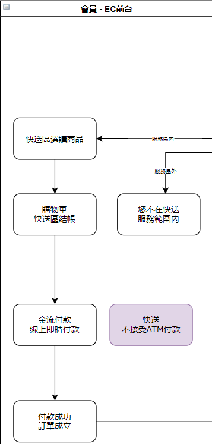

後台管理者部分，

1. **快送服務範圍設定**：可設定適用快送服務的區域，適用的區域才可進行快送購物。
2. **快送訂單管理 - 自動配單**：快送訂單成立後，系統根據目的地與Studio A門市的距離進行計算排序，並選出可滿足訂單商品的門市進行配單。
3. **快送訂單管理 - 手動處理訂單**：自動配單失敗或門市拒絕接單時，則轉由SA管理者手動處理訂單配單作業。
4. **門市接單功能**：門市可於收到訂單(無論自動/手動)後，選擇接受或不接受訂單，若接受則進入撿貨程序，撿貨完畢後，則可直接於畫面上呼叫Lalamove取件。
5. **Lalamove取件**：透過API呼叫Lalamove取件，如超過25分鐘Lalamove仍未接單則本系統自動取消叫車並重新叫車；如再過25分鐘仍未被Lalamove司機接單，則通知SA管理者手動處理。

管理者部分流程圖：

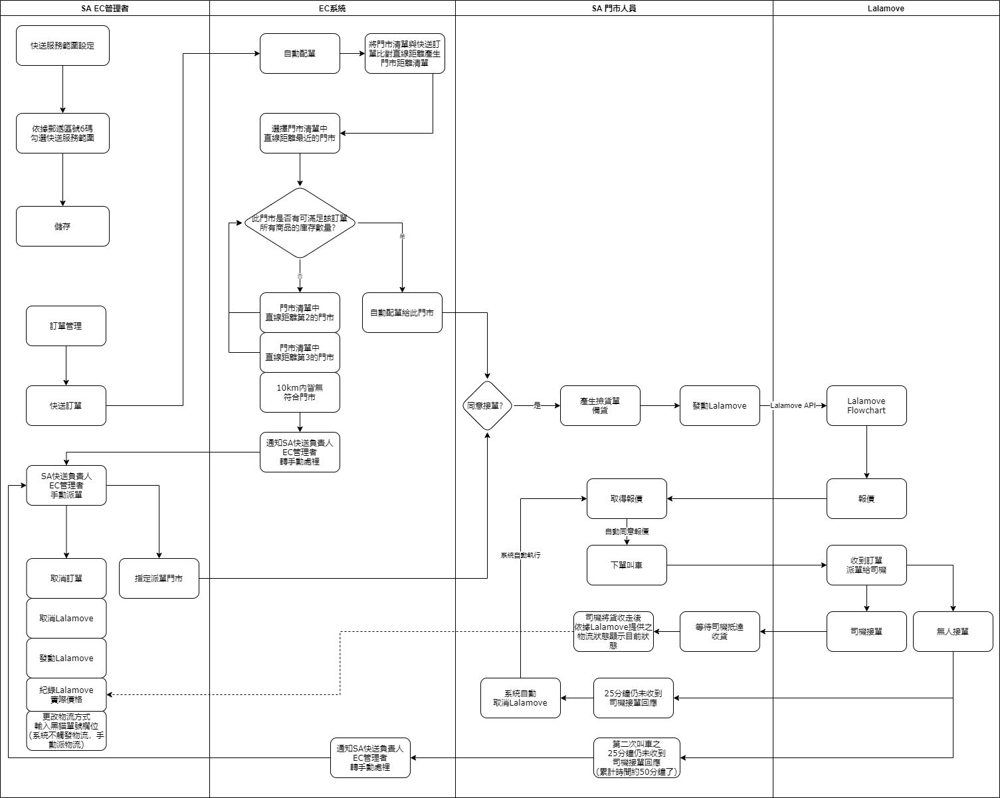

流程圖全圖：

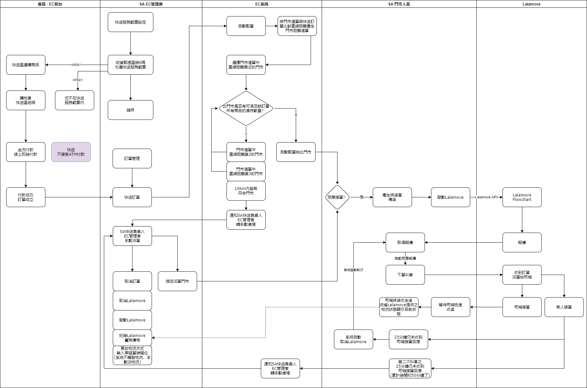

## 定期配

定即配意思是Studio A一次販售多期商品給會員，每一期商品依據該商品設定的配送週期(每月配送或每季配送)定期的配送給會員。

1. 新增定期配：選定一個商品後，進行定期配設定。

**定期配設定**：

| 欄位       | 說明                           | 必填 |      |
| ---------- | ------------------------------ | ---- | ---- |
| 週期   | 此定期配的配送週期，選項：每月 / 每季 (單選) | Y    |      |
| 發貨日  | 當上述週期到達時的幾號發貨 (每月/季幾號發貨) | Y    |      |
| 總期數 | 數字，例如12代表本商品一次販售12期 | Y    |      |
| 售價     | 自動將EPB售價 x 期數                               | Y    |      |
| 折扣 | 若定期配商品提供較優惠價格，則使用折扣方式進行優惠 | N  |      |
   1. **管理定期配訂單**：透過待出貨/已出貨區來辨別是否已經出貨，若需出貨則於待出貨區進行出貨作業，出貨作業同一般訂單出貨作業。
3. **會員購買定期配**：
   1. 購買方式與一般商品相同。
   2. 結帳付款方式為一次結清所有期數款項。
   3. 與一般商品訂單同樣是付款成功/訂單成立就開立發票、請款及送訂單資訊回EPB。
   4. 退貨流程與一般商品訂單相同。

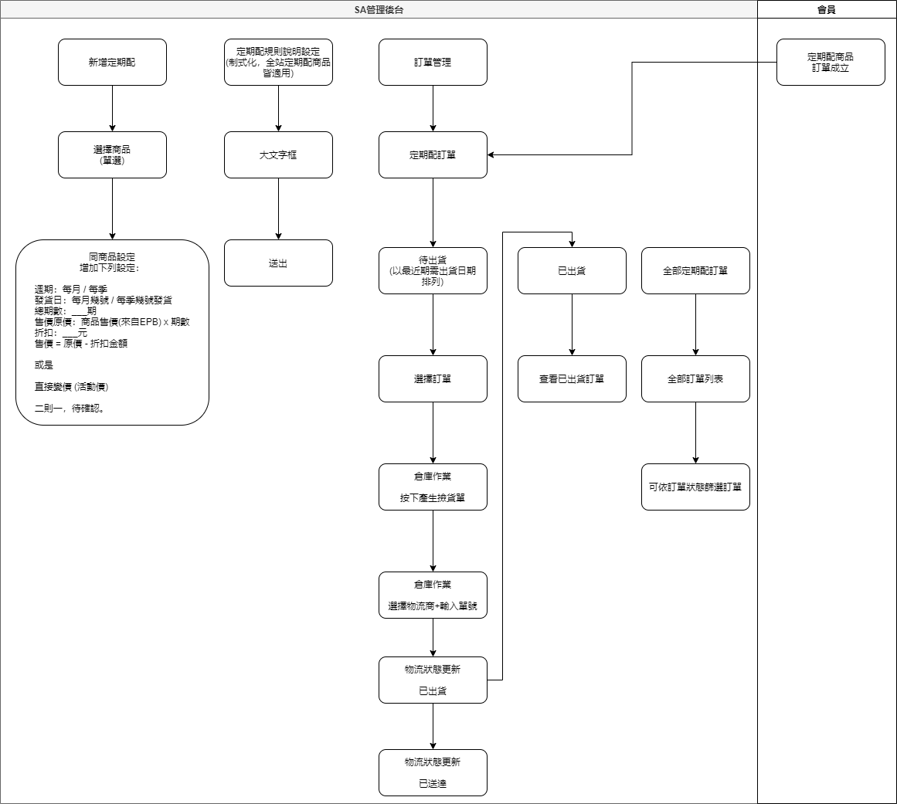

## 團購

團購方式為同一商品上架後累積訂購件數達到成團門檻後，則可享有優惠價格。

1. 僅能選擇一個商品建立團購活動。
2. 未成團前訂單不成立，狀態為尚未成團(金流僅做授權不請款)。
3. 成團機制：SA手動按下成團按鈕則立即成團、系統自動根據目前累積訂購人數判斷大於等於設定條件件數時，則自動成團(訂單成立)。
4. 如活動時間抵達時仍未達成上述成團條件也未手動成團，則本次團購活動失敗，系統自動取消累積訂購者的訂單。
5. 如活動時間尚未結束，但已成團，會員仍可參加選購該團購商品，且直接適用優惠價格及直接成團(訂單成立)。
6. 如訂單成立後，後續流程及退貨比照一般訂單處理。

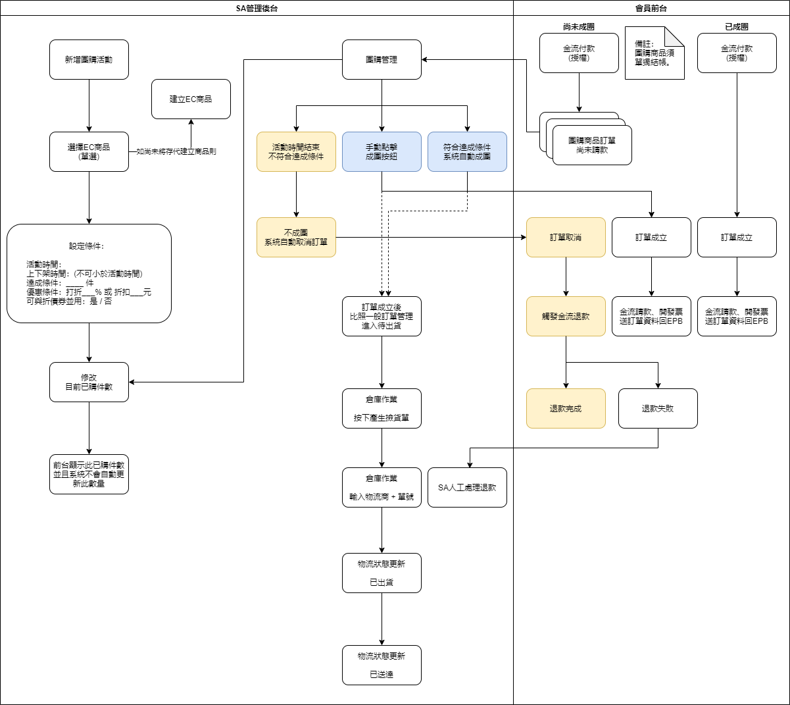

## 新機預約

## 預購商品

## 維修

### 維修預約

會員可透過EC維修預約介面進行維修時段預約，並且可在會員專區中查看或取消維修預約紀錄。

1. 需求為維修預約前端會員使用之介面重新設計，並透過API介接Studio A原本的維修預約系統方式製作。
2. 會員需登入EC會員才可進行預約。
3. 會員可透過EC會員專區查看、取消維修預約紀錄 (因API機制問題，不提供修改功能)。
4. 會員可透過EC前台預約新的維修預約。
5. 會員若收到預約失敗畫面，可重試預約並帶入前次預約失敗填過的資訊。
6. SA維修管理者依然從原有系統管理介面管理預約。

維修預約整體流程如下：

- 

需原系統提供之API：

​	需提供API、文件、成功狀況、失敗狀況

- 時段查詢API：查詢各據點可被預約時段
- 新增預約API：新增一筆預約
- 刪除(取消)預約API：刪除一筆預約

### 查詢維修及完修推播

1. 此功能為介接SA原維修RMA系統資訊，便利會員可於EC會員專區查看送修紀錄及狀態。
2. 會員需登入EC會員才可使用此功能。
3. 維修完成發送APP推播。
4. 系統可於會員取件完成時，發送維修滿意度調查Email。
5. SA維修管理者從原有RMA系統管理介面管理預約。

.svg)

需原系統提供之API：

​	需提供API、文件、成功狀況、失敗狀況

- 維修主檔建立及修改API：於RMA建立、修改維修單資訊時，同步通知EC系統。

## 課程

Studio A會開設課程給會員上課，持有上課折價券的會員可於結帳時折抵上課金額；未持有券或是券不足抵掉全部金額的部分，會員可直接使用本系統進行結帳。

### 課程預約

1. 會員可透過課程中心選課(即預約課程)、結帳、使用課程折價券結帳。
2. 會員可收到正取、備取、備取轉正取通知。
3. 會員可透過備取轉正取通知中的付款連結進行付款，完成正取報名動作。

### 課程管理

1. 課程欄位：新增課程相關欄位如下圖表格所述。
2. 差異定價：同一課程可針對不同等級之會員訂定不同價格。
3. 修改課程：管理者可以於課程的任何狀態修改所有欄位資料。
4. 取消課程：管理者可將課程取消，系統自動發送Email及APP通知會員課程取消，通知內容於後台提供文字框輸入(不預設文字)。
5. 報名管理：會員報名後，報名表彙整於課程管理中，並且可於此處將備取轉正取。
6. 滿意度調查：上完課後，課程管理者可發送滿意度調查信，內容於後台提供文字框輸入，會附帶滿意度調查連結。

.svg)

## 舊換新

舊換新功能主要提供會員可於本系統申請舊機回收，並於申請成功後透過會員Wallet取得電子禮券。

1. 會員需先登入或註冊本系統。
2. 主要步驟為會員先於Studio A舊機回收檢測APP進行檢測後，於EC登入後填寫IMEI及檢測單據代碼，EC透過API向檢測APP取得下圖中"APP回送資料"後，呈現於申請表上供會員確認無誤後，即送出舊機回收申請表。
3. SA人員則於後台查看收到的申請表後，派車將舊機收回EC總倉進行人工檢測(鑒價)，並透過系統回覆會員最終認定價格；會員可選擇接受或拒絕此價格，如會員接受價格，則需完成所得申報資料表後，SA人員於後台確認所得申報資料無誤後，操作核發宜睿電子禮券至會員Wallet中；若會員拒絕價格，則由客服個案聯繫會員，最終可能會將機器退還給會員或是調整報價後，再送出價格確認給會員。
4. 由於舊換新實質上為SA向消費者購買舊機，發給消費者現金，現金立刻購買電子禮劵，因此於上述SA後台操作產券後，需要同步產生與禮券相同金額之發票。
5. 詳細流程如下圖：

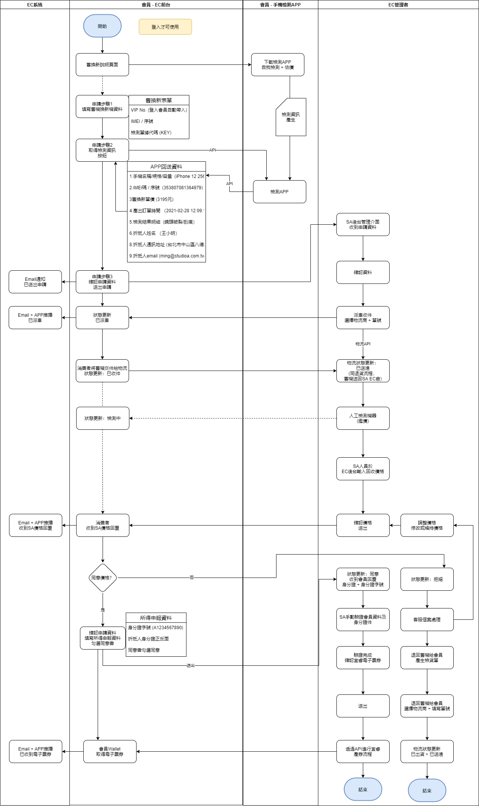

### 回傳EPB資料

舊機回收產生禮券後，需將下列資訊透過EPB訂單API回傳資料，預計需傳送資訊描述如下，由於該API規格未定，確切傳送規則依API文件而定。

1. 主機回收價格 + 帶入主機存代 (由檢測APP的API提供)

2. 同一價格變成負向 + 帶入固定存代 99901749

3. 賣禮劵的價格總額 + 一個固定的存代 (SA後續再提供確切存代)

## 帳號管理

### SA管理後台帳號管理

- 帳號清單：列出所有管理帳號。
- 新增帳號：新增一個管理帳號，並指派權限。
- 修改帳號：修改一個管理帳號的資料(不能修改帳號)，或修改指派權限。
- 重設密碼：可針對某一個管理帳號重新設定該帳號的密碼。
- 刪除帳號：永久刪除一個管理帳號。

### 供應商帳號管理

- 帳號清單：列出所有供應商帳號。
- 新增帳號：新增一個供應商帳號。
- 修改帳號：修改一個供應商帳號的資料(不能修改帳號)。
- 重設密碼：可針對某一個供應商帳號重新設定該帳號的密碼。
- 刪除帳號：永久刪除一個供應商帳號。

## 會員管理

管理者可於管理後台查看及管理會員帳號。

- 會員清單：列出全站會員。
- 查看會員資料：可查看完整該會員在EC上完整資料。
- 修改會員資料：可修改單一會員之基本資料。
- 刪除會員資料：可刪除單筆會員資料。

門市管理

## SA Care

SA Care為Studio A與新光產險提供給有購買主機的會員手機保險產品。

1. 會員於購買主機後才可購買SA Care，若成功購買SA Care後會贈送大禮包。
2. 投保：於EC端透過URL帶出訂單編號、品項、型號資訊至新光產險投保。
3. 於上述四步驟結束後即完成投保 >>
4. 新光API告知保單號碼對應訂單/產品及投保狀態(成功投保) >>
5. SA撿貨掃描IMEI碼掃描建檔 >>
6. 出貨 >> 物流送貨抵達消費者端 >>
7. API送訂單/產品+IMEI資訊+到貨日至新光 >>
8. 保單啟動生效(到貨後24小時生效) >>
9. 新光API告知保單號碼及投保狀態(保單生效狀態及時間起訖)
10. 備註：上述API確切資料細節須再核對確認。
11. 消費者於EC端點擊查詢SA Care保單 >> 透過URL導引至新光產險提供網址進行身分驗證或登入後進行查詢；URL為新光產險登入畫面，因此各投保商品皆使用同一連結進行導引登入查看保單。
12. 另，於投保完成後，新光產險也將發送完整電子保單至投保人信箱中。
13. 一個訂單編號，對應一個產品，對應一個保險；如一個訂單有多個產品，系統需要自己生成多個訂單編號(-1、-2…)。
14. 保險只有在購買主機的當下，就必須要訂購保險，如事後才要購買，EC不受理。
15. 如User選擇的是門市取貨，當User到門市後，門市人員上EC後台編輯取貨狀態，並掃商品IEMI碼填入SA Care。
16. 客戶專區：在保險紀錄查詢的部分，要備註(只能查詢近3年的保險紀錄)。
17. 不能在線上續約、要去門市辦理 (線上只顯示辦理續約的方式)
18. 申請保單、完成保單、退保都要以API做溝通

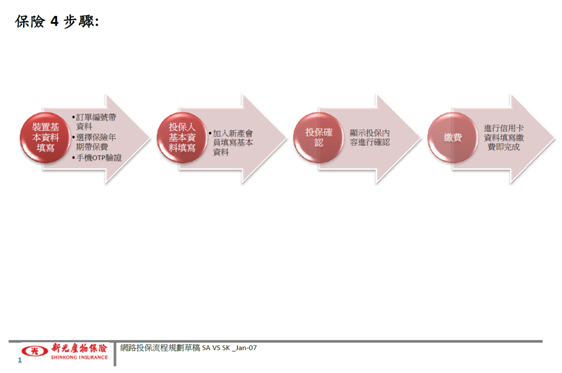

# 第三方串接

## EPB串接

EPB為Studio A使用之ERP系統，本次串接方式主要以API方式進行。

| 資料     | 說明            | 方式          |
| -------- | --------------- | ------------- |
| 商品     | EPB商品檔       | 中間表        |
| 會員     | EPB會員檔       | API：EPB > EC |
| 訂單     | EC訂單檔        | API：EC > EPB |
| 退貨     | EC退貨檔        | API：EC > EPB |
| 紅利點數 | EPB會員紅利點數 | API：EPB > EC |

## 串接清單

| 分類     | 名稱                 | 說明                            |
| -------- | -------------------- | ------------------------------- |
| 維修     | 維修預約             | 串接維修預約功能                |
| 維修     | RMA系統              | 串接維修工單及狀態              |
| 金流     | Tappay               | 串接非ATM類的線上付款           |
| 金流     | 綠界                 | 串接ATM付款                     |
| 電子發票 | 鯨躍                 | 串接電子發票                    |
| 電子禮券 | 宜睿                 | 串接電子禮券(Wallet)            |
| SA Care  | 新光產險             | 串接新光產險保險產品SA Care購買 |
| 物流     | 黑貓                 | 串接黑貓物流                    |
| 物流     | Lalamove             | 串接Lalamove物流                |
| 簡訊     | Every8D (或三竹擇一) | 串接簡訊通知                    |
|          |                      |                                 |

## 統計

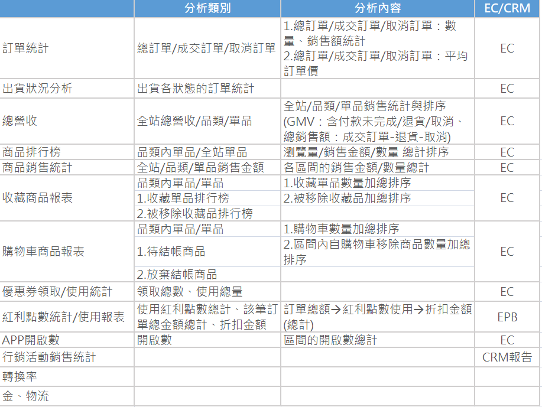

## 供應商

1. 帳號建立由SA管理者建立。
   1. 帳號 (不可更改)
   2. 密碼 (供應商可自行更改)
   3. 退換貨地址
   4. 窗口聯絡資訊
      - 名字
      - 公司電話
      - 手機
      - Email
2. 供應商登入需要有兩步驟驗證登入(Google Authenticator)。
3. 供應商僅能看到自己所屬品牌的產品 (依據EPB品牌代碼呈現)。
4. 建立商品流程同SA管理者，但僅能建立自己品牌的商品。
5. 供應商可使用功能為：商品管理、庫存管理及訂單管理，其餘後台功能不開放給供應商使用。
6. 供應商商品上架後，需經過SA管理後台審核後，才可上架。
7. 如SA管理者拒絕供應商商品，需要填寫原因並顯示給供應商。

