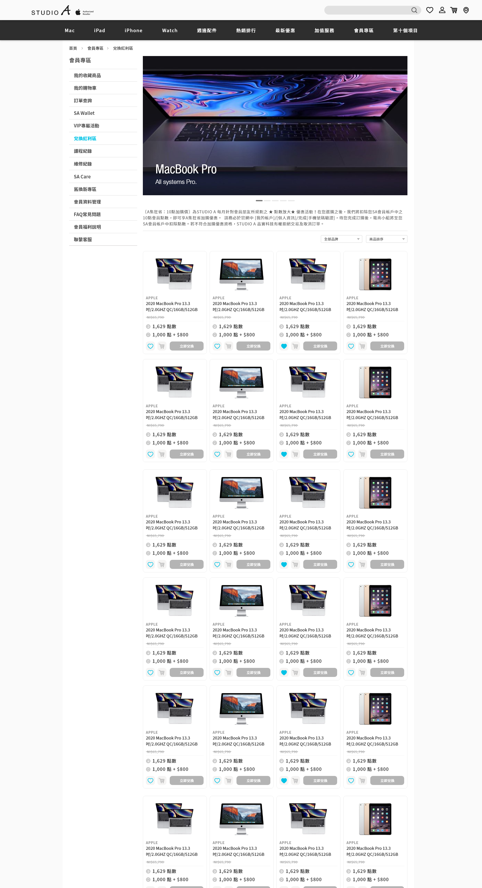
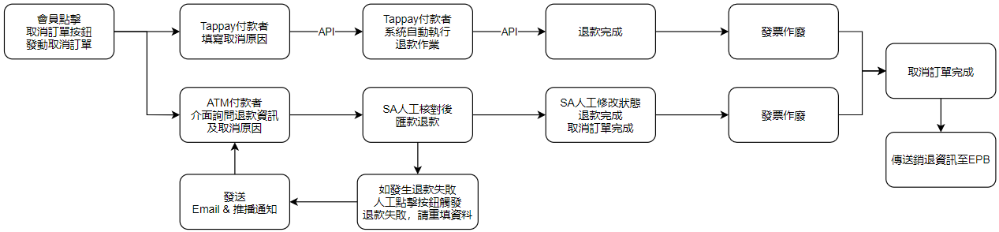
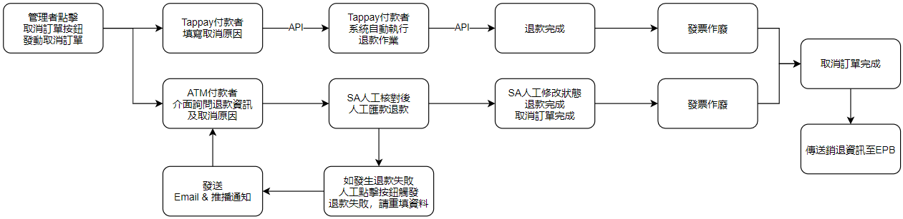
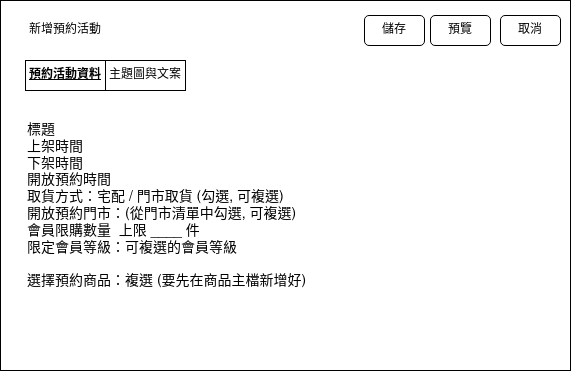
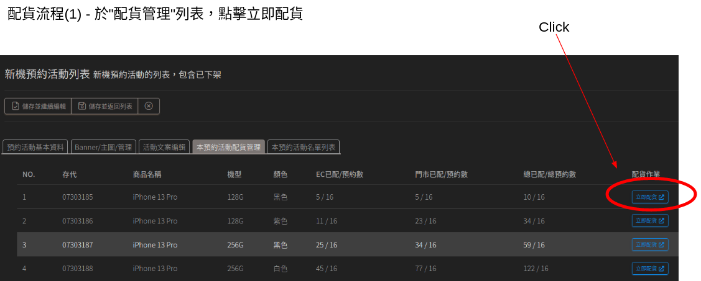

release version: 20210072301

[TOC]

# 需求架構

本系統主要分為前台(即消費者端所接觸到之功能)及後台(即管理者所管理本系統所需之功能)；其中，後台又分為兩個部分，第一部分為供應商後台，第二部分為Studio A EC管理後台(以下簡稱SA管理後台)。

**前台 / 消費者端網站及APP**：消費者/會員所見頁面屬於前台/消費者端功能。

**供應商後台**：提供廠商可自主管理商品、訂單等功能。

**Studio A管理後台**：總管全站包含商品、訂單、會員、供應商、EC前台外觀等功能。

# 前台相關

## 會員帳號

會員帳號功能主要提供會員註冊、會員登入、忘記密碼及修改密碼功能。

備註：2021/5/5決議將email驗證連結全數改成驗證碼回填方式。

### 註冊

1. 註冊首先要先輸入手機號碼取得驗證碼後，進行驗證。
2. 驗證後，要以該手機號碼透過會員查詢API至EPB查詢該會員是否為SA會員(舊會員)。
3. 若是舊會員則帶出EPB回傳的會員資料至欄位中(會員可以修改，只是方便會員加速填寫資料)以及將會員VIP No.(EPB的會員key值)除記錄儲存。
4. 若是新會員，則不須帶入任何資料，由會員自己填寫資料。
5. 會員填寫完資料送出後，除了註冊成為EC會員外，也要將會員資料透過API拋回EPB，方式如下。
   - 舊SA會員：透過VIP Binding API將會員資料拋回EPB。
   - 新SA會員：透過VIP Register API將會員資料拋回EPB，並取得EPB回傳的VIP No(EPB會員唯一值)。
6. 註冊完成後，發送Email驗證信包含驗證連結至會員信箱中，會員點該連結完成EMAIL驗證。
7. 與EPB溝通的VIP Binding/VIP Register API為原本EPB針對91APP開設的API，部分91APP的欄位用不到就直接為空就好。
8. 步驟一
9. 步驟二

### 登入

1. 可使用前述註冊之會員帳號登入本系統。

2. 如有綁定第三方登入者，可透過第三方登入方式快速登入本系統。

   

### 第三方登入綁定

1. 綁定第三方登入需先註冊成為本站會員後，方可進行綁定。
2. 每位會員可綁定一組Facebook帳戶、一組Google帳戶、一組LINE帳戶及一組Apple ID。
3. 綁定所需之Facebook、Google、LINE、Apple開發者帳號由Studio A提供。
4. 綁定後，透過Studio A提供之EPB會員API回傳綁定資料 (如何回傳須等StudioA回覆)。

### 忘記密碼

1. 若會員因忘記密碼而無法登入本系統，可使用此功能進行重設密碼。

2. 會員需輸入手機號碼索取驗證碼後，方可於本站進行重設密碼，重設完畢後，舊密碼立即失效。

3. 索取驗證碼後，驗證碼將同時寄送到email及手機中。

4. 重設密碼後，可使用新的密碼登入本系統。

5. 重設密碼後，自動將所有過去已登入的裝置登出。

   

### 修改會員資料

1. 會員自行修改資料：

2. 客服用管理後台幫會員修改資料：
   - 可以修改欄位：
   - 會員修改電話(手機/帳號)流程：會員打電話給客服 --> 要求修改電話 (即EC登入帳號, 若原電話為:0911111111, 改成新的電話為:0922222222) --> 客服進入後台找到該會員後，選擇編輯，並把會員電話/帳號改成 0922222222 --> 修改後系統將此使用者的手機驗證狀態從已驗證改為未驗證, 並強制登出(若無法強制登出, 則於畫面上顯示"您需要完成手機驗證才可以開始購物，請先登出後再重新登入以進行手機驗證，謝謝") --> 客服電話線上要求會員立即登出並且"使用新的手機號碼為帳號(密碼不變)"重新登入 --> 登入後系統將會員直接引導到註冊的"手機驗證"步驟處進行手機驗證 --> 回填手機簡訊號碼 --> 驗證成功 --> 系統將該會員標注為已驗證 --> 結束。
     
   - 電話線上要求會員立即登出並重新登入

### 會員資料表

每日會員初次瀏覽EC(APP或PC)時，打API更新上述資料 或是 每日排程半夜去更新所有會員資料(不確定是否會跑非常久)。

EC的會員資料與EPB會員資料分離儲存，讓EPB同步近來的資料不會去複寫修改到EC的資料。

|會員欄位名稱|來源                 |備註 |
|------|-------------------|---|
|* EC會員編號|EC |EC系統產生的會員唯一值，不可修改, 永遠保持不變 |
|VIP No(VIP代碼) |EPB                | 來自EPB的會員唯一值，不可修改, 永遠保持不變 |
|手機    |EPB/EC             | 會員無權修改，管理者後台可修改，要重新驗證 |
|Email |EPB/EC             | 會員修改後須重新驗證Email |
|姓名    |EPB/EC             | 會員無權修改，管理者後台可修改 |
|出生年份  |EPB/EC             | 會員無權修改，管理者後台可修改 |
|出生月份  |EPB/EC             | 會員無權修改，管理者後台可修改 |
|出生日期  |EPB/EC             | 會員無權修改，管理者後台可修改 |
|(預設地址) 郵遞區號  |EC                 |   |
|(預設地址) 城市    |EC                 |   |
|(預設地址) 地區    |EC                 |   |
|(預設地址) 詳細地址    |EC                  |   |
|會員等級  |EPB                | EC無法修改，會員無權修改 |
|累積消費金額|EPB                | EC無法修改，會員無權修改 |
|會籍到期日 |EPB                | EC無法修改，會員無權修改 |
|目前總點數 |EPB | EC無法修改，會員無權修改 |
|註冊推薦碼  |EC                 | 英文+數字 |
|註冊推薦日期  |EC                 | YYYY-MM-DD, HH-MM-SS |
|email驗證判斷|EC                 | T/F |
|email驗證日期|EC                 | YYYY-MM-DD, HH-MM-SS |
|手機驗證判斷|EC                 | T/F |
|手機驗證日期|EC                 | YYYY-MM-DD, HH-MM-SS |
|瀏覽紀錄  |EC                 | product id + YYYY-MM-DD, HH-MM-SS |
|登入次數  |EC                 |  |
|首次登入APP日期|EC                 | YYYY-MM-DD, HH-MM-SS |
|最後登入APP日期|EC                 | YYYY-MM-DD, HH-MM-SS |
|電子報(EDM)同意書|EC | Y/N |
|隱私與條款同意書|EC | Y/N |
|第三方帳號綁定|EC | FB/Google/LINE/Apple ID帳號綁定 |

### 會員常用通訊錄

會員可於自己的基本資料中，**紀錄最多5組**常用通訊錄(不含前面會員的預設地址1組)，於結帳的時候可快速選取運送地址。

| 欄位項目            | 說明        |
| ------------------- | ----------- |
| 姓名                | 收件人姓名  |
| 手機                | 收件人手機  |
| Email               | 收件人Email |
| (常用地址) 郵遞區號 | 收件地址    |
| (常用地址) 城市     | 收件地址    |
| (常用地址) 區域     | 收件地址    |
| (常用地址) 詳細地址 | 收件地址    |

### 會員紅利點數

會員可於本系統查詢總點數、查詢點數明細以及使用點數。點數資訊由於需結合線上及線下點數，因此主要計算機制維持在EPB計算。

1. **查詢點數**：會員可於前台查詢目前擁有紅利點數 (EPB點數查詢API)。
2. **查詢點數紀錄**：會員可於前台查詢紅利點數歷史紀錄(最多27個月) (EPB點數紀錄查詢API)。
3. **結帳點數查詢**：會員於結帳時可同步看到目前可折抵點數，並且使用此點數折抵部分金額 (EPB點數查詢API)。
4. **結帳點數折抵**：會員結帳時可使用紅利點數折抵整筆訂單一定比例金額(不可超過該比例金額)，此比例%依據百分比在管理後台設定 (透過訂單API傳回EPB進行折抵)；結帳時可使用的點數不可超過該換會員的總點數。
5. **線上訂單累積點數**：透過訂單API傳回EPB，EPB根據訂單資訊計算累積點數。
6. **線上訂單退貨扣除點數**：透過訂單API傳回銷退至EPB，EPB根據訂單銷退資訊計算扣回點數。
7. **結帳點數折抵設定**：於管理後台可依據會員等級設定結帳點數折抵上限百分比%。
8. **紅利點數折抵**：結帳時兩點折抵一元。
9. 使用API：查詢會員積點明細Get VIP Point Detail
10. 每次結帳前都要用API去更新會員等級 & 積點資料。

### SA Wallet

### 會員紀錄

1. 帳號活動Log (登入, 登入device, 登入IP, 帳號修改密碼, 修改會員資料)
2. 商品瀏覽紀錄 (EC商品id, 商品名稱, 商品頁網址, 瀏覽時間, ip位址)
3. 收藏商品紀錄 (會員id, 商品id, 加入時間, 移除時間, 是否轉加入購物車)
4. 購物車紀錄 (會員id, 商品id, 加入時間, 移除時間, 是否結帳, 是否轉為收藏)

### 收藏商品

### 購物車
1. 非會員可將商品加入購物車，但結帳的時候要登入/註冊才能結帳。
2. 每件商品被加入購物車之前所在的分類/活動頁要被記錄下來，因此購物車內的每個商品就只會適用這個優惠活動。
3. 購物車紅利點數(總點)是透過EPB API至EPB查詢。
4. 可折抵點數透過管理後台點數折抵設定全站/分類/商品可折抵點數上限。

### 搜尋

# 後台

## 後台登入介面

後台登入介面分為SA管理後台及供應商後台介面。

1. **SA管理後台登入介面**

   所有Studio A員工針對本網站的各種權限管理者，皆透過此介面進行登入，登入後可依據各個帳號權限對網站前後台、商品、促銷、網站設定、帳號等功能進行設定。

   登入介面使用：帳號、密碼、兩步驟驗證登入(Google Authenticator)代碼登入。

2. **供應商後台登入介面**

   Studio A管理者可幫供應商開設供應商帳號，供應商則可透過供應商後台登入供應商帳號後，直接跟對該供應商(自己)的商品進行管理。
   
   登入介面使用：帳號、密碼、兩步驟驗證登入(Google Authenticator)代碼登入。
   
   

## 商品

商品檔分為本系統(EC)商品檔及EPB商品檔。

**EC商品檔**：本系統之各項功能操作皆使用此商品檔，KEY值為商品編號。

**EPB商品檔**：由EPB透過中間表同步至EC的商品檔，EC僅取用部分欄位做為EC商品檔之資料源，本系統各項功能無法直接使用EPB商品檔操作。

### EPB存代列表

本功能把EC資料庫儲存的EPB商品檔以列表方式呈現，管理者可以從列表中搜尋及瀏覽資料，不能做任何修改。修改同一維持在資料源頭EPB修改，透過每日同步方式更新到EC端資料庫。

**介面需求：**

1. 搜尋：透過存貨代碼搜商品、透過名稱搜商品、透過型號搜商品
2. 列表+篩選：將EPB商品檔資料列出

**同步方式**：Studio A提供中間表/中繼資料庫，EC每日固定時間去抓資料過來EC資料庫，但須與Salesforce抓取時間錯開 (因為此中繼資料庫是共用的)。

**EPB商品檔欄位**

此為EPB商品檔原始資料欄位中英文名稱。

- [Studio A提供商品資料](https://drive.google.com/drive/folders/1vRf0BSOtiSpImMP-ig6mtcN-E6RoeSEM)

| EPB商品檔  | 欄位名稱            | 來源 |
| ---------- | ------------------- | ---- |
| 已刊登 | 若此EPB商品有被任何EC商品用到，則顯示"已刊登"  (20210515會議) | EC |
| 狀態標籤   | statusFlg           | EPB  |
| * 存貨代碼 | stkId               | EPB  |
| 名稱       | name                | EPB  |
| 型號       | model               | EPB  |
| 公司代碼   | orgId               | EPB  |
| 公司名稱   | orgId (orgName)     | EPB  |
| 零售定價   | retailListPrice     | EPB  |
| 條碼1      | barCode1            | EPB  |
| 條碼2      | barCode2            | EPB  |
| 品牌代碼   | brandId             | EPB  |
| 品牌名稱   | brandId (brandName) | EPB  |
| 類別1代碼  | cat1Id              | EPB  |
| 類別1名稱  | cat1Id (cat1Name)   | EPB  |
| 類別2代碼  | cat2Id              | EPB  |
| 類別2名稱  | cat2Id (cat2Name)   | EPB  |
| 類別3代碼  | cat3Id              | EPB  |
| 類別3名稱  | cat3Id (cat3Name)   | EPB  |
| 類別4代碼  | cat4Id              | EPB  |
| 類別4名稱  | cat4Id (cat4Name)   | EPB  |
| 類別5代碼  | cat5Id              | EPB  |
| 類別5名稱  | cat5Id (cat5Name)   | EPB  |
| 類別6代碼  | cat6Id              | EPB  |
| 類別6名稱  | cat6Id (cat6Name)   | EPB  |
| 類別7代碼  | cat7Id              | EPB  |
| <del>類別7名稱</del>  | <del>cat7Id (cat7Name)</del> | EPB  |
| 建立日期   | createDate          | EPB  |
| 最後更新日 | lastupdate          | EPB  |

### 類別7品牌對照表

類別7為前台顯示之商品品牌，EC透過EPB資料同步取得類別7代碼(意即商品的品牌代碼)，至於每個代碼所代表的品牌名稱，由SA管理者在EC類別7對照表維護。

例如：類別7代碼=7685，對照表維護名稱為RAV Power

| 類別7代碼                | EC品牌名稱 |
| ------------------------ | ---------- |
| 7001  (舉例, 非實際代碼) | Apple      |
| 7658  (舉例, 非實際代碼) | RAV Power  |

### 商品管理

若是全新的商品(未在EPB建立也未在EC建立)管理者必須提早一天先在EPB建立存代後，隔天透過同步後存入EC資料庫中，然後再開始在EC建立EC商品。

新增商品：新增一檔EC商品，選擇對應EPB商品檔後，依序輸入下列欄位資訊，商品檔為操作本系統各項功能之基礎，需先建立商品檔後才可運用商品檔設定其他功能，例如促銷、主題活動等。

**商品管理及資料同步流程**：

#### 商品型態

- 一般商品
  - 單規格商品 (一個EC商品對應一個EC虛擬庫存、一個EPB商品存代)
  - 組合商品 (一個EC商品對應一個EC虛擬庫存、多個EPB商品存代)
  - 多規格商品 (一個EC商品，有多種不同規格選項，各規格對應各自的虛擬庫存及各                                                                                                                                  自EPB商品存代)
- 預購商品 (所有設定同一般商品，僅多了預計配送日期&前台有預購的tag顯示，可以把預購直接合併到一般商品內多一個選項勾選即可)
  - 單規格
  - 組合
  - 多規格
- 快送商品 (歸類在快送分類下的商品，適用快送訂單流程)
  - 單規格
  - 組合
  - 多規格
- 教育優惠商品 (Apple) (歸類在教育優惠分類下的商品，適用Apple教育優惠訂單流程)
  - 單規格
  - 組合
  - 多規格
- 教育優惠商品 (序號商品) (歸類在教育優惠分類下的商品，適用非Apple產品教育優惠訂單流程)
  - 單規格
  - 組合
  - 多規格
- 序號商品 (一般價格) (適用序號商品訂單流程，要用Email出貨)
  - 單規格
  - 組合
- 電子禮券 (適用電子禮券流程，要透過API向宜睿取券，存入會員Wallet中)
  - 單規格
- 紅利兌換商品 (禮品) (有純點/點加金兩種價格需要設定，結帳時須強制用點數/點加金結帳)
  - 單規格
  - 組合
- 定期配商品 (一次購買多期商品，然後定期配送給會員，設定主要與一般商品相同，多了期數、折扣及配送日)
  - 單規格
  - 組合
  - 多規格(不同期數)
- 團購商品 (設定同一般商品，主要多了成團件數及團購優惠)
  - 單規格
  - 組合
- 預約商品 (預約商品設定項目同一般商品，需搭配預約活動使用)
  - 單規格
  - 組合
  - 多規格
- 贈品 (0元商品做為贈品使用，需設定好後，搭配促銷模組使用)
  - 單規格
  - 組合
  
  

#### EC商品檔(新增/編輯)

|EC商品檔 |來源                 |備註 |
|------|-------------------|---|
|商品型態  |管理者填寫              |   |
|* EC商品編號|本系統, 不可修改                |系統產生KEY值|
|存貨代碼  |EPB, 不可修改                |EPB KEY值 (通常只會對應一個, 組合商品會對應多個)|
|廠商代碼  |EPB, 不可修改                |資料來自EPB品牌代碼, 管理者不可於EC修改|
|廠商名稱 |EPB, 不可修改 |資料來自EPB品牌名稱, 管理者不可於EC修改|
|品牌代碼  |EPB, 不可修改                |資料來自EPB類別7, 管理者不可於EC修改|
|品牌名稱 |EC, 不可修改 |管理者於EC維護類別7對照表，根據類別7代碼顯示對應之品牌名稱 如需修改要到類別7對照表修改品牌名稱對應。|
|品名    |從EPB存代對應的品名預先帶入，但管理者可以修改 (20210515會議)              |在前台顯示之名稱|
|商品圖    |管理者上傳 (影片部分要可以選擇置頂/置尾) 多規格商品要個別設定不同規格/顏色的圖，且是整組圖換掉，不是只換一張              |至少1張，上限10張；可包含1個Youtube連結 商品主圖處的YouTube影片需求數量為1則，可選擇置於置頂/置尾。|
|商品摘要  |管理者填寫              |   |
|商品介紹  |管理者填寫 文字編輯器部分，不開放自訂字體、字型大小，直接設定模板給使用者選擇，樣板已經設定好字體大小及樣式：大標題、副標題、內文、重點強調 (20210515會議)              | 可包含圖、文、Youtube |
|所屬分類  |管理者填寫，可多選              | 可參考Shopline設定方式  |
|建議售價  |管理者填寫              | 前台要畫一槓delete線的價格(非實際售價) |
|零售定價  |EPB, 不可修改                |商品實際售價, 資料來自EPB, 管理者不可於EC修改|
|活動價   |管理者填寫              |如有設定活動價格則自動取代EPB價格|
|教育價   |管理者填寫              |於教育優惠專區使用之價格, 取代EPB價格|
|員工價   |管理者填寫              |於員工隱賣專區使用之價格, 取代EPB價格|
|庫存    |管理者填寫, 如多規格商品需要各自設定庫存 虛擬倉：EC倉、供應商倉、客服倉、快送倉(快送倉又會分為所有門市都會有一個倉)              | 倉別細節詳見"[庫存管理](#庫存管理)"章節 |
|限制商品購買數量 |管理者填寫 | 該商品頁單次上限可被購買的數量，會在商品頁&購物車被檢核 [Shopline參考](https://support.shoplineapp.com/hc/zh-tw/articles/115005552326-%E9%99%90%E5%88%B6%E5%95%86%E5%93%81%E8%B3%BC%E8%B2%B7%E6%95%B8%E9%87%8F-%E6%88%91%E7%9A%84%E5%95%86%E5%93%81) |
|上架時間  |管理者填寫              |  |
|下架時間  |管理者填寫              |   |
|運送方式  |管理者勾選 (若需設定新增運送方式需到網站設定內新增)              |   |
|付款方式  |管理者填寫              |   |
|限時購買  |管理者填寫，限時購買起訖時間              | 商品只有在起訖時間內可被購買 |
|建立日期  |本系統, 不可更改                |   |
|建立者   |本系統, 不可更改                |   |
|最後修改日 |本系統, 不可更改                |   |
|最後修改者 |本系統, 不可更改                |   |
|商品異動紀錄 |本系統, 不可更改 | |
|Title |管理者填寫              |SEO設定|
|Description|管理者填寫              |SEO設定|
|Keyword|管理者填寫              |SEO設定|
|描述性URL|管理者填寫              |SEO設定|

Shopline商品管理參考圖

**更新售價**

由於本系統商品實際售價來源為EPB零售定價且不開放人工修改該欄位價格，因此系統每日同步資料後，採依序批次更新方式將售價更新。

其他價格活動價、教育價、員工價、建議售價則由EC管理者自行維護修改，本系統不會自動更新這幾個價格。

**複製商品**

管理者可以選取某個商品，然後直接複製該商品的所有資料去建立一支新的商品。(因為有可能是同一隻商品，做不同活動價格或是類似的商品只是修改部分內容)。

#### 產品規格表

共有四種表可填寫，由上架人員自行填寫。

1. 帶電 (如下欄位)
2. 非帶電 (如下欄位)
3. 食品 (如下欄位)
4. 其他 (空白文字編輯器)
5. 不顯示 (不需填寫，前台也不顯示)

**帶電**

| ．商品型號：     |
| ---------------- |
| ．商品名稱：     |
| ．商品顏色：     |
| ．商品尺寸：     |
| ．重　　量：     |
| ．輸入電壓：     |
| ．ＰＤ輸出：     |
| ．ＱＣ輸出：     |
| ．輸出功率：     |
| ．材　　質：     |
| ．包裝內含：     |
| ．商品保固：     |
| ．產　　地：     |
| ．BSMI許可字號： |

**非帶電**

| ．商品型號： |
| ------------ |
| ．商品名稱： |
| ．商品顏色： |
| ．商品尺寸： |
| ．重　　量： |
| ．材    質： |
| ．適用機型： |
| ．商品保固： |

**食品**

| 內容物名稱                   | 成分： 食品添加物 過敏源資訊 |
| ---------------------------- | -------------------------------------- |
| 內容量                       |                                        |
| 豬肉可食部位之原料原產地(國) |                                        |
| 原產地(國)                   |                                        |
| 保存期限                     |                                        |
| 廠商名稱                     |                                        |
| 廠商電話                     |                                        |
| 廠商地址                     |                                        |
| 投保產品責任險字號           |                                        |
| 食品業者登錄字號             |                                        |

#### 商品更新紀錄

類似下圖商品紀錄，會有更新時間、更新項目、更新者，若為庫存異動則會有庫存異動數字。

#### 多規格商品

多規格商品為一商品有多種不同規格(顏色、容量等)之商品，舉例來說，iPhone 12在規格上有多種顏色及容量，且EPB存代亦不同，但皆須呈現在同一個EC商品頁上，因此須設定多規格商品來將一個EC商品對應多種規格、多個存代及多種價格。

多規格商品須要有至多兩層選單，可設定：**顏色、容量、尺寸或自訂(自行輸入規格名稱)**。

多規格商品建立時，亦要上傳各SKU的顯示圖片，整組圖換掉，不是只換一張。

多規格商品限制商品購買數量：(擇一設定) 可以個別設定每個商品的上限購買數量，或是設定所有規格加總最高購買數量。

[Shopline參考](https://support.shoplineapp.com/hc/zh-tw/articles/204883825-%E5%95%86%E5%93%81%E8%A6%8F%E6%A0%BC%E8%88%87%E6%AC%BE%E5%BC%8F-%E5%95%86%E5%93%81)、[蝦皮參考](https://help.shopee.tw/tw/s/article/%E5%A6%82%E4%BD%95%E8%A8%AD%E5%AE%9A%E5%95%86%E5%93%81%E8%A6%8F%E6%A0%BC)

| EC商品頁         | EPB存代 (非真實存代, 僅做為舉例) | 商品      | 規格       | 售價  |
| ---------------- | -------------------------------- | --------- | ---------- | ----- |
| iPhone 12 商品頁 | 10001                            | iPhone 12 | 藍色 128G  | 22000 |
| iPhone 12 商品頁 | 10002                            | iPhone 12 | 藍色 256G  | 25000 |
| iPhone 12 商品頁 | 10003                            | iPhone 12 | 藍色 512G  | 28000 |
| iPhone 12 商品頁 | 10004                            | iPhone 12 | 銀色 128G  | 22000 |
| iPhone 12 商品頁 | 10005                            | iPhone 12 | 銀色 2568G | 25000 |
| iPhone 12 商品頁 | 10006                            | iPhone 12 | 銀色 512G  | 28000 |

#### 組合商品

組合商品為超過一種不同種類的EPB商品組成一個EC商品以利綑綁銷售，組合商品與多規格商品不同之處為組合商品僅有一個售價且所有商品綑綁銷售，而非獨立讓消費者選購，舉例來說，iPhone 12 Pro 新機優惠組合包，內含主機、保護貼及保護殼，整包販售27999元。

組合商品與一般商品的欄位設定：組合商品必須要新增兩個設定

1. 要設定對應多個EPB商品存代 (一般商品只能對應一個)
2. 要設定折扣存代 (新增一個折扣存代欄位讓管理者輸入)
3. 要設定折扣金額 (參照下方範例)

**組合商品庫存維護**：EC端只維護一個EC商品庫存 (不維護各個EPB存代庫存，各個存代庫存由StudioA自行透過EPB控管)。

**組合商品價格為**：EPB原價 - 折扣，整個組合商品會對應一個折扣&折扣存代。

**訂單(銷售)API拋回EPB**：若訂單中包含組合商品，拋回EPB的訂單資訊中必須將組合商品之原始存代分別列出，需要包含原價、折扣及折扣存代。

- 舉例：iPhone 12 Pro 新機優惠組合包

| EPB存代 (非真實存代, 僅做為舉例) | 商品          | 規格          | 金額        |
| -------------------------------- | ------------- | ------------- | ----------- |
| 2001                             | iPhone 12 Pro | 紅色 256G     | 12,000      |
| 2002                             | 玻璃保護貼    | iPhone 12 Pro | 500         |
| 2003                             | 犀牛頓保護殼  | iPhone 12 Pro | 1,000       |
| 6666                             | 折扣          |               | -200        |
|                                  |               |               | 售價 13,300 |

#### 紅利兌換商品 (禮品) 

有純點/點加金兩種價格需要設定，結帳時須強制用點數/點加金結帳，其餘商品設定同一般商品設定。

1. 純點
2. 點 + 金
3. 下圖範例的規格名稱是錯的，不會有兩種規格，紅利商品僅准一種規格，兩種價格(純點/點+金)

#### 序號商品

序號商品主要差異在補庫存 & 送貨流程 (後面詳述)。

- 序號商品一旦經過配送後，**便不接受退貨**，因此無退貨按鈕。

- 會員可於訂單頁面自行點擊重新發送序號信件，系統就重新把該會員購買的那組序號再發一次給會員。

- 序號商品為免運項目 (單獨結帳序號商品不受免運門檻限制皆為免運；可與其他商品湊全站免運門檻)。

  **序號商品出貨**

  - 系統自動出貨，流程：訂單成立(確認金流付款完成後) > 開立發票 > EC系統Email自動出貨(發送序號給會員)。
  - 自動Email出貨時，系統將自動從序號庫存中取用一組序號出貨，系統依先進先出概念出貨序號商品，即較早上傳的序號、要較先出貨給客戶。
  - Email出貨後，將該組序號標記為已出貨、註記出貨時間、訂單編號、會員編號。
  - SA管理者/客服可於後台查詢各組序號發送狀態。

**序號商品 - KKOBX教育優惠**

- 序號商品教育優惠步驟與Apple教育優惠商品相同，但不需edu信箱驗證程序。
- 序號商品教育優惠的新增商品與管理庫存方式同序號商品一般方式。
- SA管理者於後台進行驗證資料後，若審核通過則系統自動出貨，發送序號Email至購買者信箱。
- 上傳證件大小不限制、不壓縮。

**序號商品庫存管理**

- 序號商品庫存數量 = 上傳的序號數量
- 透過上傳序號csv進行補庫存。

**補庫存：序號CSV上傳**：

1. EC管理者先選擇要上傳補庫存的序號商品(補庫存 = 上傳序號.csv檔)。
2. 於該序號商品庫存處點擊匯入序號csv檔。
3. 匯入後系統要做紀錄如下表二。
4. 系統需記錄補貨時間 (上傳csv檔時間)。
5.  系統須提供制式csv檔格式範本供下載。

表一：客戶序號範例

說明：客戶序號檔上傳只會有序號資訊，EC系同不去控管序號期限，只要系統內未被發送出去的序號就算是可以發送給會員的序號(可用)。

| 序號 |
|--------------|
|SAM19103100001|
|SAM19103100002|
|SAM19103100003|
|SAM19103100004|
|SAM19103100005|
|SAM19103100006|
|SAM19103100007|
|SAM19103100008|
|SAM19103100009|
|SAM19103100010|
|SAM19103100011|
|SAM19103100012|
|SAM19103100013|
|SAM19103100014|
|SAM19103100015|

表二：EC系統內序號商品庫存管理/庫存紀錄範例：

| EC商品                             | 序號                           | 新增時間            | 狀態   | 出貨時間            | 訂購會員                 | 訂單編號                   | 刪除               |
| ---------------------------------- | ------------------------------ | ------------------- | ------ | ------------------- | ------------------------ | -------------------------- | ------------------ |
| 主檔編號、主檔內項目編號、商品名稱 | QW9JAJC8SDF (舉例, 非真實序號) | 2021-04-01 19:00:00 | 已出貨 | 2021-04-02 19:05:00 | AB1234, 0912123123, 姓名 | TM0001(點了可以連到該訂單) | - (已出貨不可刪除) |
| 主檔編號、主檔內項目編號           | QW8JC89SDN (舉例, 非真實序號)  | 2021-04-01 19:00:00 | 已出貨 | 2021-04-03 11:22:00 | BB2234, 0910003123, 姓名 | TM0099(點了可以連到該訂單) | -                  |
| 主檔編號、主檔內項目編號           | 398J48WEFNS (舉例, 非真實序號) | 2021-04-01 19:00:00 | 未發送 | 無                  | 無                       | 無                         | 刪除此序號         |
| 主檔編號、主檔內項目編號           | QWOIMEIS(舉例, 非真實序號)     | 2021-04-01 19:00:00 | 未發送 | 無                  | 無                       | 無                         | 刪除此序號         |
| 主檔編號、主檔內項目編號           | QWOEOQIWE(舉例, 非真實序號)    | 2021-04-01 19:00:00 | 未發送 | 無                  | 無                       | 無                         | 刪除此序號         |

#### 電子禮券(宜睿)

- 電子禮券商品由於需要串接API，因此電子禮券商品工程師預先建立好，但還是要允許能做基本資料的修改(例如修改商品圖片、商品名稱、售價等)，只要是跟API有關的資訊都不允許手動更改。
- 宜睿禮券結帳與付款流程同一般商品，唯出貨是由系統自動出貨至會員Wallet中的票夾。
- 取券、兌換、查餘額都是透過宜睿API進行，詳細API規格及流程請參照宜睿的API文件。
- 禮券商品為免運項目 (單獨結帳禮券商品不受免運門檻限制皆為免運；可與其他商品湊全站免運門檻)。
- 購券後接收宜睿通知部份，需開一個API接口給宜睿串接，API開立規格須依照宜睿提供之PDF文件"Notification"這份去製作，key的部份則與宜睿提供的API其餘key使用同一key。
- 會員票匣中，因API一次呼叫過多張數可能會timeout，根據宜睿經驗，約30張內較不會造成timeout，因此目前先預設會員進入票匣時一次只load最多30張券，待會員操作需要看到超過已load的30張券時，才去load更多的券，但每次load的上限都是30張。此30張券的上限，可在測試階段時，實測是否太多或太少進行調整正式上線時每次load的數量。
- 舊換新最終步驟EC核發禮券與此處的宜睿禮券是一樣的禮券，只不過舊換新不用付款(因為是回收手機的殘值)。
- 使用與測試情境：https://docs.google.com/document/d/1lJo0TodvuMJWEPP8rcdIDfoxTqpJvgKRMOBqdU8axO0/edit#

#### 定期配商品

#### 教育優惠商品 (APPLE & 序號)

1. 使用教育價欄位價格。
2. 需要填寫資料、上傳證件及通過審核，才可完成整個訂單流程。
3. edu信箱驗證由Studio A信箱發送制式PDF檔文件給會員，會員簽名後寄回Studio A信箱。
4. 審核由SA管理者手動審核，後台可查看會員填寫及上傳之資料。
5. 上傳證件大小不限制、不壓縮。
6. 如最終通過審核則直接出貨。
7. 如最終未通過審核則由SA人員手動觸發取消訂單。
8. 取消訂單相關系統機制比照一般訂單取消流程處理。
9. 教育優惠發票不可打統編。

#### 贈品檔設定

| 欄位       | 說明                               |      |
| ---------- | ---------------------------------- | ---- |
| 贈品名稱   | 前台顯示贈品名稱                   |      |
| 存代       | 贈品對應EPB存代                    |      |
| 圖片       | 贈品圖片                           |      |
| 特色       | 贈品簡短特色說明                   |      |
| 庫存       | 可設定數字，倉別有EC倉及各個門市倉 |      |
| 上下架時間 | 輸入時間區間                       |      |
| 啟用狀態   | 開啟/關閉                          |      |

1. 贈品檔若庫存<=3時發送警示給SA管理者。
2. 預約不適用滿額贈。
3. 贈品價格於結帳訂單上採用折扣方式折價，例如贈品EPB售價100元則給負向金額做為折扣-100，相加等於0元。

#### 相關商品推薦

每個商品頁下方皆可呈現相關商品推薦，此相關商品需由後台先行設定後，才會顯示，若未設定則不顯示。

- 設定方式：依分類設定 / 依單品設定
- 推薦商品清單：指定商品 / 指定分類

#### 缺貨通知

若商品庫存為0則在前台顯示缺貨，若會員按下缺貨通知我，則會在庫存>1時寄信&APP推播通知會員。

### 分類管理

1. 同一商品可上架於一個或多個分類。
2. 分類最多三個層級例如：Mac > Mac主機 > iMac
3. 在一般分類給管理者直接勾選分類屬性：一般/教育/隱賣/，這個部分需要討論。
4. 基本設定可參考他站設定：[連結1](https://support.shoplineapp.com/hc/zh-tw/articles/204207409-%E8%A8%AD%E5%AE%9A%E5%95%86%E5%93%81%E5%88%86%E9%A1%9E#2.2)   [連結2](https://support.shoplineapp.com/hc/zh-tw/articles/204207129--%E8%A8%AD%E5%AE%9A%E5%95%86%E5%93%81%E5%AD%90%E5%88%86%E9%A1%9E#2)   [連結3](https://deo.shopeemobile.com/shopee/seller/seller_cms/46620417405ebbcacab29627d0b9830e/%E6%88%91%E7%9A%84%E8%B3%A3%E5%A0%B4%E5%88%86%E9%A1%9E%E4%BD%BF%E7%94%A8%E6%89%8B%E5%86%8A.pdf)

| 欄位        | 說明                                        |
| ----------- | ------------------------------------------- |
| 分類名稱    | 此分類顯示的名稱 (固定分類者無須設定此名稱) |
| Banner      | 分類頁上的Banner圖，上限五張圖              |
| 商品        | 需陳列在此分類的商品                        |
| Title       | 此分類的SEO title                           |
| Description | 此分類的SEO description                     |
| Keyword     | 此分類的SEO keyword                         |

**前台分類頁：**

#### 固定主分類 - 教育專區

- 此分類為固定主分類
- 管理者可自行新增此分類下的子分類
- 只有教育優惠商品可被新增到此分類
- 其他教育優惠商品詳情請見商品 - 教育優惠商品。

#### 固定主分類 - 隱形賣場

(可自行新增此主分類下的子分類)

隱形賣場為一個只有指定等級會員才可以看到的賣場，管理者可針對各等級需求加入或移除商品至該等級的隱形賣場品類中。

設定隱賣商品上架時，可複選會員等級。

| 會員等級    | 是否有隱形賣場功能 | 隱形賣場能見度                 |
| ----------- | ------------------ | ------------------------------ |
| 鑽石會員    | 有                 | 僅鑽石會員登入後可見到該賣場   |
| 白金會員    | 有                 | 僅白金會員登入後可見到該賣場   |
| 標準會員    | 有                 | 僅標準會員登入後可見到該賣場   |
| 集點卡會員  | 有                 | 僅集點卡會員登入後可見到該賣場 |
| 員工        | 有                 | 僅員工登入後可見到該賣場       |
| 未登入/訪客 | 無                 | 無                             |

#### 固定主分類 - 團購

(可自行新增此主分類下的子分類)

由於團購的商品前台呈現形式不同，因此團購商品只能加入團購的分類中。

#### 固定分類 - 兌換紅利專區

(此分類只有一層，不會有子分類)

會員可於此專區內使用較優惠的點數或點數+現金換得此區的商品。

案例1：原本在一般訂單內僅能用紅利點數折抵15%金額，但若是紅利兌換專區則可能可以100%用點數兌換。

案例2：原本為兩點可折抵1元，若100元商品原本換算等同200點紅利點數，但在紅利兌換區可以用100點換得。

- 額外設定價格欄位：紅利點數 + 現金兩欄(點+金)及純點，且兩者皆為必填。
- 會員選購時須選擇點+金或純點結帳(單選)。
- 不使用EPB售價。
- 需獨立結帳。

#### 固定分類 - 快送專區

### 供應商上架商品

供應商新增好商品後，要按下送出審核，等待SA審核完畢後才會上價。

1. 供應商只能新增自己供應商的商品(EPB商品檔的品牌代碼/品牌名稱)，不能新增其他供應商的商品。

2. 建立商品流程同SA管理者，但僅能建立自己品牌的商品。

3. 供應商商品上架後，需經過SA管理後台審核後，才可上架。

4. 如SA管理者拒絕供應商商品，需要填寫原因並顯示給供應商。

5. SA協助上架之商品，須給廠商再次確認；廠商上架商品須給SA審核。

   **供應商商品上架提交流程：**

   

### 庫存管理

可針對已建立好的商品管理庫存。

1. 需先建立商品才可於庫存管理中管理該商品庫存。(此處商品指的是EC商品，不是EPB商品)
2. 本系統是透過虛擬倉機制進行庫存管理，管理者需針對EC商品維護庫存，系統將以管理者輸入之庫存數量運作本系統之銷售/退貨相關機制。
3. 庫存機制為EC虛擬倉，管理者可針對各EC商品之虛擬倉庫存數量進行調整。
4. 可針對商品/加購品/贈品/序號進行補貨。
6. 本系統僅能針對EC庫存進行管控，無法針對EPB系統庫存進行管理；EPB針對EC訂單之庫存增減透過EC拋回之成交訂單資訊至EPB後，由EPB根據每筆訂單內容自行計算增減EPB庫存。
7. 安全庫存量：系統於安全庫存低於3個時系統通知EC後台管理者/廠商告警。
8. 備註：庫存管理方式為針對EC商品虛擬倉進行管理，無法針對EPB存代商品進行庫存管理。
8. Shopline庫存管理參考圖

**虛擬倉別表**

|虛擬倉         |適用訂單     |地址               |
|------------|---------|-----------------|
|STUDIO A EC倉|EC所有訂單   |台北市中山區八德路二段260號  |
|供應商倉        |所有供應商出貨訂單|供應商填寫地址          |
|客服倉         |無        |無                |

**快送虛擬倉(門市)**
可自行新增快送虛擬倉，系統計算快送目的地距離時從虛擬倉輸入的地址去判斷距離。為了避免倉別錯亂，倉庫不可刪除，只能停用。

必填欄位：倉庫名稱、地址

備註：快送要用這個倉庫地址跟送貨地址比對距離去算出要派單給哪家門市，使用Google Maps API。

|虛擬倉         |適用訂單     |地址               |
|------------|---------|-----------------|
|海洋大學        |僅限EC快送訂單 |基隆市中正區北寧路2號      |
|清華大學        |僅限EC快送訂單 |新竹市光復路二段101號     |
|亞洲大學        |僅限EC快送訂單 |台中市霧峰區柳豐路500號    |
|東海大學        |僅限EC快送訂單 |台中市西屯區臺灣大道四段1727號|
|文化大學        |僅限EC快送訂單 |台北市士林區華岡路55號     |
|政治大學        |僅限EC快送訂單 |台北市文山區指南路二段64號   |
|台北大學        |僅限EC快送訂單 |新北市三峽區大學路151號    |
|淡江大學        |僅限EC快送訂單 |新北市淡水區英專路151號    |
|成功大學        |僅限EC快送訂單 |台南市東區勝利路118號     |
|逢甲大學        |僅限EC快送訂單 |台中市西屯區文華路100號    |
|高雄師範大學      |僅限EC快送訂單 |高雄市苓雅區和平一路116號   |
|中興大學        |僅限EC快送訂單 |台中市南區國光路250號     |
|輔仁大學        |僅限EC快送訂單 |新北市新莊區中正路510號    |
|中央大學        |僅限EC快送訂單 |桃園市中壢區五權里中大路300號 |
|大安門市        |僅限EC快送訂單 |台北市大安區忠孝東路四段98號  |
|阿波羅門市       |僅限EC快送訂單 |台北市大安區忠孝東路四段218號 |
|新西門         |僅限EC快送訂單 |台北市萬華區峨嵋街43號     |
|士林門市        |僅限EC快送訂單 |台北市士林區文林路138號    |
|高島屋門市       |僅限EC快送訂單 |台北市士林區忠誠路二段55號   |
|永和門市        |僅限EC快送訂單 |新北市永和區永和路1段174號  |
|站前維修中心      |僅限EC快送訂單 |台北市南陽街1號         |
|桃園統領        |僅限EC快送訂單 |桃園市桃園區中正路61號     |
|新竹中正門市      |僅限EC快送訂單 |新竹市東區中正路28號      |
|新竹光復        |僅限EC快送訂單 |新竹市光復路2段198號     |
|苗栗尚順門市      |僅限EC快送訂單 |苗栗縣頭份鎮中央路105號    |
|台中中科門市      |僅限EC快送訂單 |台中市西屯區永福路136號    |
|台中精誠門市      |僅限EC快送訂單 |台中市西屯區精誠路48號     |
|台中彩虹        |僅限EC快送訂單 |台中市英才路474號       |
|台中公益維修中心    |僅限EC快送訂單 |台中市西區公益路151號     |
|台南大億西門門市    |僅限EC快送訂單 |台南市南區西門路1段653號   |
|高雄三多門市      |僅限EC快送訂單 |高雄市苓雅區三多三路254號   |
|高雄大統門市      |僅限EC快送訂單 |高雄市新興區五福2路262號   |
|花蓮門市        |僅限EC快送訂單 |花蓮市中山路172號       |
|羅東門市        |僅限EC快送訂單 |宜蘭縣羅東鎮興東路10號     |
|大立門市        |僅限EC快送訂單 |高雄市前金區五福3路57號    |
|微風門市        |僅限EC快送訂單 |台北市松山區復興南路1段39號  |
|美麗華門市       |僅限EC快送訂單 |台北市中山區敬業三路20號    |
|板橋誠品門市      |僅限EC快送訂單 |新北市板橋區中山路一段46號   |
|夢時代門市       |僅限EC快送訂單 |高雄市前鎮區中華五路789號   |
|新竹遠百門市      |僅限EC快送訂單 |新竹市西大路323號8號     |
|中壢大江門市      |僅限EC快送訂單 |桃園市中壢區中園路二段501號  |
|桃園台茂門市      |僅限EC快送訂單 |桃園市蘆竹區南崁路一段112號  |
|台中豐原太平洋門市   |僅限EC快送訂單 |台中市豐原區復興路2號1樓    |
|板橋遠百門市      |僅限EC快送訂單 |新北市板橋區中山路一段152號  |
|新莊宏匯        |僅限EC快送訂單 |新北市新莊區新北大道四段3號   |

## 訂單

### 訂單流程

會員下單後，須立即完成結帳動作後(ATM付款者則為付款完成後)，才會轉為訂單成立狀態，此時即觸發系統開立發票(1張訂單開立1張發票)，完成開立發票後，隨即傳送該筆訂單資訊至EPB留存紀錄。接著，SA人員才會開始進行出貨作業，出貨則可能是單筆或分批(多筆)出貨。 

**結帳使用電子禮券**：

**回傳EPB**：禮券抵用訂單回傳EPB要透過API訂單傳禮券抵用的存代回EPB：99902111於訂單中。

**發票**：若使用電子禮券/即享券(都是宜睿禮券)，則使用禮券的金額不開發票，因當初購禮券時已經開過發票。例如消費1000元，使用800元電子禮券，則只開立200元禮券。

### 訂單管理介面

**訂單狀態**：訂單狀態在後台拆開來顯示，狀態若有串接則依照串接來的狀態判斷變更，但依然開放可手動修改狀態(部分沒串接或出問題情況)

訂單狀態：訂單成立、取消訂單、已完成(所有貨都出完)

付款狀態：未付款、付款失敗、超過付款時間、已付款、退款中、已退款

出貨狀態：未出貨、備貨中、已出貨、已到達、退貨中、已退貨

**一般訂單**

管理一般/組合/預購/定期配/序號/贈品/隱賣/紅利兌換/電子禮券訂單

分區：全部訂單、待出貨、已出貨、已取消

功能：查看訂單、搜尋訂單、出貨(串黑貓或選擇沒串接的物流商自己輸入單號)、取消訂單

Shopline畫面提供參考：送貨狀態下方的待處理/備貨中/已發貨，這個做成按鈕可以按，按下去就可以做更改送貨狀態/執行出貨作業。

#### 快送訂單

快送訂單管理，包含快送相關自動派單流程處理，請參照下方快送機制說明。

#### 教育訂單

教育訂單管理/教育優惠審核/教育訂單上傳資料查看，細節請參照下方團購機制說明。

狀態除了上面的訂單狀態外，多一個驗證狀態(未驗證、驗證成功、驗證失敗)，這個狀態由管理者自行修改。

1. 本分類所使用價格皆為教育價欄位。
2. 本分類下的商品原訂單結帳流程外，還需要額外填寫資料、上傳證件及通過審核。
3. edu信箱驗證由Studio A信箱發送制式PDF檔文件給會員，會員簽名後寄回Studio A信箱。
4. 審核由SA管理者手動審核，後台可查看會員填寫及上傳之資料。
5. 上傳證件大小不限制、不壓縮。
6. 如最終通過審核則直接出貨。
7. 如最終未通過審核則由SA人員手動觸發取消訂單。
8. 取消訂單相關系統機制比照一般訂單取消流程處理。
9. 教育優惠發票不可開立統編。

### 出貨作業

本段出貨作業為一般訂單出貨作業，快送出貨作業參照下方快送章節。

出貨部分則由SA產生撿貨單、出貨單後，進行出貨處理作業，接著若為主機商品，則需輸入主機IMEI序號留存於本系統，非主機商品則無需做此動作；接著輸入物流單號進行物流叫件，一般出貨主要以黑貓為主，若為黑貓叫件則本系統將透過API呼叫黑貓進行叫件及物流狀態更新；若非黑貓叫件者，則本系統不負責呼叫API叫件，僅提供物流商及物流單號紀錄功能。

**分批出貨**：同一訂單可分多次出貨，分批出貨要於前後台顯示每次出貨的商品。

**出貨倉庫**：前台要顯示門市出貨/總倉出貨/廠商出貨

### 會員訂單功能

- 會員可於前台查詢24個月內的訂單及狀態。
- 可於介面上看到分批出貨的品項。
- 訂單商品若金額為0的品項，顯示 – 不要顯示 0。
- 會員可於訂單介面針對訂單或單品進行提問，提問後以email傳送，客服可透過email收到詢問信件。
- 可於訂單介面辦理取消訂單、退貨。
- 訂單取消/退貨按鈕呈現時機如下圖。

**前台訂單狀態及按鈕顯示**

前台會員所見之訂單狀態依據當下所執行到的步驟而定，詳細如下圖說明。

### 取消訂單流程

會員可於商品尚未進入撿貨階段取消訂單，取消訂單無須經過SA管理者審核，由系統自動執行取消及退款作業；唯獨無法執行線上自動退款者(ATM)依然需由SA手動退款 (如ATM尚未付款者亦由系統自動取消訂單)，如退款失敗則通知會員重新填寫退款資訊，並帶入上一次填寫的匯款資訊提供修改。

- 如自統發票作廢動作無效(API回傳失敗)，則於後台顯示狀態並由會計手動處理該發票。

- 企業於退貨頁面可下載折讓單，企業發票退貨(發票有打統編)，若走折讓，需填寫折讓單並郵寄紙本回Studio A。

**管理者取消訂單**：

根據實際需求，部分特殊情況可能需要管理者協助取消訂單，因此後台開放管理者取消客戶訂單。

### 退貨流程

會員可於撿貨後直到7天鑑賞期截止前辦理退貨作業 (SA管理後台則不受限，隨時皆可退貨)，會員須填寫退貨原因(ATM付款者須另外填寫退款資訊表單以利手動退款作業)。

SA人員則於收到退貨需求後開始處理，首先執行逆物流派車收回商品，待商品抵達倉庫後，則進行檢驗，檢驗後勾選退貨項目、確認可退款金額、是否加收補收單後，由財快人員確認款項無誤，則進行退款作業，同樣若非ATM訂單則自動退款、ATM訂單則由SA人員手動退款後，手動修改系統退款狀態完成退貨作業。

- 本系統於整段退貨作業皆執行完畢(已退款狀態)時，透過API回傳訂單銷退資料至EPB。

- 企業於退貨頁面可下載折讓單，企業發票退貨(發票有打統編)，若走折讓，需填寫折讓單並郵寄紙本回Studio A。

- 一般未打統編發票無須折讓單。

**前台訂單退貨狀態**

前台會員所見之訂單退貨狀態依據當下所執行到的步驟而定，詳細如下圖說明。

**退貨單介面參考：**

### 補收單

補收單為會員退貨時，若有相關費用需被額外收取，則使用此功能從退款金額中補收。

**補收項目**：運費、贈品、包裝/整新費、活動/折扣價差、已出貨/缺少商品。

**補收金額**：由SA管理者自行填寫金額。

- 補收單如選擇整新費，前台欄位自動計算30%預帶入數值，可自行修改金額，實際金額依照修改後確認送出的金額為準。
- 補收單與原訂單做關聯，呈現於原訂單下方。

**會員前端呈現**：與退貨訂單資訊一起呈現，顯示補收項目 + 金額。

**回傳EPB**：補收單以訂單形式傳送回EPB。

備註：補收單如有另外收費成立的訂單，要跟原本訂單作關聯，且在後台管理介面要與原訂單一起呈現

**補收單建立：**

於退貨單處理介面，每張TS都有一個按鈕 > 建立補收單

**補收單建立介面：**

針對該TS新增補收單，需選擇"補收項目"、填寫補收金額、選擇補收方式(單選：從退貨款項扣除 或 產生補收訂單及連結)

**補收項目**：運費、贈品、包裝/整新費、活動/折扣價差、已出貨/缺少商品。

### 訂單回傳EPB

- TM為訂單母單號、TS為訂單子單號。
- 每條TS數量皆為1，如同一商品訂購多個數量，則會有多條數量為1的TS。
- Studio A尚未提供正式API文件(EPB還在開發)，以下為SA提供的API欄位檔案。

### EC訂單/回傳EPB訂單資料

詳細資料可同步查閱EPB API資料。

| 類別 | 項目                      | 說明                                                         | 備註                                                 |
| ---- | ------------------------- | ------------------------------------------------------------ | ---------------------------------------------------- |
| 母單 | 建立日期                  |                                                              |                                                      |
|      | 訂單編號                  | 母單號TMxxxx                                                 |                                                      |
|      | 訂單狀態                  | 訂單成立、訂單失效、訂單取消                                 |                                                      |
|      | 訂購管道                  | APP/Web(PC)/Web(Mobile)                                      |                                                      |
|      | 訂購會員                  | VIP代碼 + EC會員編號                                         | EPB需求資料                                          |
|      | 訂購人資訊                | 姓名/手機/email/地址                                         |                                                      |
|      | 收貨人                    | 姓名/手機/地址                                               |                                                      |
|      | 部門代碼                  | SA1081                                                       | EPB需求資料                                          |
|      | 門市代碼                  | EC                                                           | EPB需求資料                                          |
|      | ITEM條目數量              |                                                              | EPB需求資料                                          |
|      | 交易類型                  | 固定放A                                                      | EPB需求資料                                          |
|      | 幣別                      | NTD                                                          | EPB需求資料                                          |
|      | 匯率                      | 1                                                            | EPB需求資料                                          |
|      | 訂單總金額(原幣)          | xxxx                                                         | EPB需求資料                                          |
|      | 訂單總金額(本幣)          | xxxx                                                         | EPB需求資料                                          |
|      | 付款狀態                  | 未付款, 待請款, 已付款, 付款失敗, 已退款, 退款中             |                                                      |
|      | 付款日期                  |                                                              |                                                      |
|      | 付款方式                  | 信用卡/...Pay                                                | EPB需求資料                                          |
|      | 分期方式                  |                                                              |                                                      |
|      | Tappay欄位需求            | Tappay需要存的欄位請參考[Tappay文件](https://docs.tappaysdk.com/tutorial/zh/home.html) |                                                      |
|      | 發票狀態                  | 未開立, 已開立, 開立失敗, 已作廢, 已折讓, 重新開立           |                                                      |
|      | 項次                      | 1                                                            | EPB需求資料                                          |
|      | 發票日期                  |                                                              | EPB需求資料                                          |
|      | 發票號碼                  |                                                              | EPB需求資料                                          |
|      | 載具號碼                  |                                                              |                                                      |
|      | 統一編號                  |                                                              | EPB需求資料                                          |
|      | 稅額符號                  | 固定放 +                                                     | EPB需求資料                                          |
|      | 幣別                      | NTD                                                          | EPB需求資料                                          |
|      | 匯率                      | 1                                                            | EPB需求資料                                          |
|      | 付款代碼                  | 信用卡/...Pay                                                | EPB需求資料                                          |
|      | 分批出貨                  | Y/N                                                          |                                                      |
|      | 使用禮券                  | Y/N  (如使用禮券，則明細會多一條使用禮券的負向金額 ＆儲存當時使用禮券從宜睿API得到的資訊) |                                                      |
|      | 使用折扣                  | Y/N (如使用折扣，則明細會多一條使用折扣的負向金額 & 折扣存代) |                                                      |
|      | 出貨狀態                  | 未出貨、出貨處理中、部份已出貨、已出貨                       |                                                      |
| 子單 | 子單號TSxxxx              |                                                              |                                                      |
|      | 物流單號                  |                                                              | 備註：可能會分批出貨，就會每個項次都有可能有物流單號 |
|      | 送貨物流商                | 黑貓, Lalamove…                                              |                                                      |
|      | 出貨日期                  |                                                              |                                                      |
|      | 物流方式                  | 快送：Q / 宅配：H                                            | EPB需求資料                                          |
|      | 物流價格                  | 消費者結帳的物流價格, 會出現在購物明細中                     |                                                      |
|      | 物流成本                  | Lalamove須把API回傳的成本記下來, 存在系統中可被SA管理者查看  |                                                      |
|      | 物流狀態                  | 未出貨、出貨處理中、已出貨 (因可能會分開出貨，每一條明細都會顯示出貨狀態) |                                                      |
|      | 物流商API回傳狀態         | 已出貨、已送達...                                            |                                                      |
|      | 物流商API回傳狀態最後時間 | 最後一次收到狀態更新的時間                                   |                                                      |
|      | 項次 (不可重複)           | 1, 2, 3 …                                                    | EPB需求資料                                          |
|      | 項次參考                  | 固定放 801                                                   | EPB需求資料                                          |
|      | 項次類型                  | 空, 除了VIP兌換贈品(888)要放X                                | EPB需求資料                                          |
|      | 存貨代碼                  |                                                              | EPB需求資料                                          |
|      | 購買商品EC id             |                                                              | EPB需求資料                                          |
|      | 規格                      | 多規格商品用                                                 |                                                      |
|      | 型號                      |                                                              | EPB需求資料                                          |
|      | 主機序號或商品序號        | Apple主機序號或KKBOX等儲值序號                               |                                                      |
|      | 購買商品名稱              |                                                              | EPB需求資料                                          |
|      | 購買商品數量              |                                                              | EPB需求資料                                          |
|      | 單位代碼                  | 固定放PCS                                                    | EPB需求資料                                          |
|      | 單位比例                  | 固定放 1                                                     | EPB需求資料                                          |
|      | 商品定價                  | 等於售價                                                     | EPB需求資料                                          |
|      | 商品淨價                  | 等於售價                                                     | EPB需求資料                                          |
|      | 折扣%                     | 0                                                            | EPB需求資料                                          |
|      | 折扣                      | 0                                                            | EPB需求資料                                          |
|      | 單價                      |                                                              | EPB需求資料                                          |
|      | 小計                      |                                                              | EPB需求資料                                          |
|      | 促銷活動代碼              |                                                              | EPB需求資料                                          |
|      | 備註                      |                                                              | EPB需求資料                                          |
|      | 倉庫代碼                  | 固定SA801                                                    | EPB需求資料                                          |
|      | 調撥單的出庫倉            | 固定SA036, 除了VIP兌換贈品(888)是放SA801                     |                                                      |

**支付透過Tappay支付流程**

### 需獨立結帳項目

| 項目             | 需獨立結帳 | 原因                               |
| ---------------- | ---------- | ---------------------------------- |
| 一般商品         | N          | 無                                 |
| 組合商品         | N          | 無                                 |
| 快送             | Y          | 流程不同、配送方式不同             |
| 預購             | N          | 無                                 |
| 預約             | Y          | 會員訂購流程不同、後端處理流程不同 |
| 定期配           | N          | 無                                 |
| 教育優惠(含序號) | Y          | 會員訂購流程不同、後端處理流程不同 |
| 兌換紅利 (禮品)  | Y          | 無                                 |
| 序號商品         | N          | 無                                 |
| 課程             | Y          | 會員訂購流程不同                   |
| 贈品             | N          | 無                                 |
| 隱形賣場         | N          | 無                                 |
| 電子禮券         | Y          | 無                                 |
| 團購             | Y          | 無                                 |

## 快送

快送即快速配送，預計2小時內將會員訂購商品(快送訂單)透過機車快遞Lalamove送抵訂單指定地址。

1. 快送區為獨立一個分類，會員進入此分類需先透過會員所輸入之地區判斷是否位於快送服務區內，如符合則可開始選購快送商品；如不符合則無法進行選購。
2. 會員購物車內之快送商品獨立呈現於快送購物車中，會員可於此購物車選擇單筆或多筆快送商品進行結帳。
3. 快送訂單配送方式一律使用Lalamove進行配送，不開放會員選擇其他配送方式。
4. 快送訂單僅開放線上即時付款，一律不開放ATM付款。
5. 快送訂單之退貨流程比照一般訂單處理。
6. 快送訂單統一由一家門市出貨。
7. 門市需維護各門市虛擬庫存數量以利後續快送派單機制進行。
8. Lalamove接單後回傳之實際運費價格需儲存於EC並呈現於訂單管理處供查看。
9. 會員所見之物流狀態為Lalamove回報之物流狀態，如Lalamove未回報狀態或手動出貨者，則已出貨之商品物流狀態僅呈現"已出貨"。

**快送派單機制**

1. 快送訂單成立後，系統自動將此訂單上的配送地址與Studio A提供之門市清單比對，並取出9KM內的門市第1家(即離配送地址最近的店)，確認虛擬庫存可滿足訂單需求後，則將該快送訂單派送給該門市，門市需選擇確認接單或拒絕接單，如該門市選擇拒絕接單，則自動將此單轉配給下一順位之門市，以此類推，直到9KM內的門市皆無法/拒絕接單後，派回總公司EC管理者，由總公司決定由哪家門市派送，調撥單亦由總公司手動作業。
2. 門市接單人員需填寫接單人員員工編號。
3. 門市撿貨完成後，則可透過API呼叫Lalamove取件，如超過25分鐘Lalamove仍未接單則本系統自動取消叫車並重新叫車，如本系統呼叫Lalamove達2次(共計50分鐘)Lalamove皆無回應接單，則系統自動取消Lalamove叫件，並以Email與網頁推播通知接單門市處理。
4. 備註：第1項描述之接單門市與配送地址之距離比對運算，透過Google Maps API計算，此部分可能產生Google端收費由Studio A負擔，Google開發者帳號Studio A申請後提供本系統開發。
5. **快送服務範圍設定**：可設定適用快送服務的區域，適用的區域才可進行快送購物。

**快送訂單資料回拋EPB**

1. 比照一般訂單，於訂單成立時送訂單資料回EPB。
2. 於門市接下該快送訂單後(點擊確認接單)，送銷退前述1所送出之訂單資料、再送門市接單後的新訂單資料(會多了接單門市員工編號)至EPB。
3. 備註：此部分API文件尚未提供。

**流程圖**：

## 定期配 (商品)

定即配意思是Studio A一次販售多期商品給會員，每一期商品依據該商品設定的配送週期(每月配送或每季配送)定期的配送給會員。

**定期配設定**：

| 欄位       | 說明                           | 必填 |
| ---------- | ------------------------------ | ---- |
| 適用商品 | 選擇某一商品去做定期配 | Y |
| 週期   | 此定期配的配送週期，選項：每週 / 雙週 / 每月 (單選) | Y    |
| 發貨日  | 設定 每週/雙週/每月 的發貨日期 | Y    |
| 建議售價 | 自訂  (前台被劃掉的那個價格) | Y |
| 總期數 | 數字，例如12代表本商品一次販售12期 | Y    |
| 售價原價   | 自動將EPB售價 x 期數                               | Y    |
| 折扣 | 若定期配商品提供較優惠價格，則使用折扣方式進行優惠 | N  |
| 正式售價 | 系統計算= (售價原價) - (折扣金額)=得出正式售價  (實際賣價/結帳價格) | Y |
   1. **管理定期配訂單**：透過待出貨/已出貨區來辨別是否已經出貨，若需出貨則於待出貨區進行出貨作業，出貨作業同一般訂單出貨作業。
3. **會員購買定期配**：
   1. 購買方式與一般商品相同。
   2. 結帳付款方式為一次結清所有期數款項。
   3. 與一般商品訂單同樣是付款成功/訂單成立就開立發票、請款及送訂單資訊回EPB。
   4. 退貨流程與一般商品訂單相同。

## 團購 (商品)

團購方式為同一商品上架後累積訂購件數達到成團門檻後，則可享有優惠價格。

1. 僅能選擇一個商品建立團購。
2. 未成團前訂單不成立，狀態為尚未成團(金流僅做授權不請款)。
3. 成團機制：SA手動按下成團按鈕則立即成團、系統自動根據目前累積訂購人數判斷大於等於設定條件件數時，則自動成團(訂單成立)。
4. 如活動時間抵達時仍未達成上述成團條件也未手動成團，則本次團購活動失敗，系統自動取消累積訂購者的訂單。
5. 如活動時間尚未結束，但已成團，會員仍可參加選購該團購商品，且直接適用優惠價格及直接成團(訂單成立)。
6. 如訂單成立後，後續流程及退貨比照一般訂單處理。
7. 團購商品在前台僅能被陳列在"團購"分類中，因為團購的商品顯示的形式與一般商品不同。

## 新機預約 (活動)

此功能提供會員於新機開賣前可先行預約，待新機到貨後SA管理者再依序通知會員付款完成訂單及宅配。

- **名單排序規則**：等級優先於時間排序。
- **匯出功能：**客戶未至門市取貨，門市人員可透過匯出報表查看名單。
- **前台呈現**：預約為以活動頁+預約商品形式呈現
- **限時限量**：一檔預約可能會有多個不同商品開放預約，限額部分以整個活動累計數量做限額。

### 新機預約後台介面製作參考

1. 預約主功能頁 (預約列表頁)

   可新增預約活動、看現有的所有預約活動、編輯預約活動(同現有後台的編輯方式)、預約管理活動

2. 若點擊新增預約活動則進入新增畫面

   若編輯活動一樣用這個介面。

3. 若從預約主功能頁 (預約列表頁)點擊 "預約管理"，則可進入該則預約的詳細管理介面

   此介面分三個頁籤(子頁面)

   1. 預約管理：即主要預約的狀態一覽 & 配貨功能
   2. 預約名單：即陳列所有本次預約活動下的預約者名單與狀態等細節
   3. 預約細節：即前面新增預約活動時填寫的活動資料"檢視"頁面 (僅檢視不提供修改編輯)

   預約管理頁面：

   - 因為同一檔預約會有很多種商品、各個商品又會有各種機型與顏色，因此在預約管理頁面把所有商品/機型/顏色全數列出，並提供配貨按鈕，若針對個別商品/機型/顏色要配貨則去按該按鈕。

預約管理 > 配貨按鈕 > 配貨popup功能

- 點擊配貨按鈕後，popup配貨的商品資訊 & 一個可填數字的欄位讓管理者可以填寫配貨數量。
- 配貨數量不可超過目前剩餘的總數，例如總預約數為1000，若已經配了200，則最高只能填寫800否則會出現錯誤。
- 無論門市/EC取貨，配貨排序皆是一起計算排序，因此只需要一個欄位填寫配貨數量即可。

#### 實際配貨流程說明

1. 於列表要配貨的商品機型顏色點擊"立即配貨"
2. 在配貨視窗輸入"配貨數量"數字後 -> 按下配貨。
3. (系統運算：運算排序：先從最高會員等級開始，最早預約者，未被配貨者開始排序配貨)
4. 顯示該商品機型顏色的所有名單，並把系統剛才運算的配貨名單勾選起來。
5. 管理者可在這個預排配貨名單中，調整配貨的會員，例如把系統排的某個人取消勾選、把某個還沒排到的人勾選起來。
6. 管理者重新勾選好之後，按下"確認配貨"按鈕，系統正式將此份配貨清單儲存到系統中，並且觸發後續流程(訂單/email/推播訊息等)。

預約名單：

- 詳細表格資料見此Excel：https://docs.google.com/spreadsheets/d/1m5AzoBhrNbeuLZs3Urqrj9nJu9C3TsROL57jEfxw88A/edit#gid=0
- 這邊就是把所有在這檔預約下有預約的全部預約資訊顯示出來。
- 同時，門市人員需要上來這個介面操作"變更狀態"的部份，要在列表處可以直接編輯狀態，要可以支援批次修改狀態。

預約細節：

- 即本預約活動資訊的檢視。

### 新機預約流程

## 預購商品  (商品)

預購商品之結帳與退貨流程皆與一般商品相同，主要差異為預購商品並非即時出貨，下單結帳後須等待出貨時間接近時才會出貨。

可以把預購直接合併到一般商品內多一個選項勾選即可。

## 主題活動

主題活動修改：主題活動不會自己獨立存在，要跟著促銷活動去建立。此段尚未討論，需討論。

### VIP活動

針對VIP會員所推出的活動，會員登入後才可以看到活動。

**活動設定**：

| 欄位            | 說明                                                         | 必填 |      |
| --------------- | ------------------------------------------------------------ | ---- | ---- |
| 活動名稱        | 此活動名稱                                                   | Y    |      |
| 活動摘要        | textarea，用於meta description & 活動列表頁標題底下的活動摘要顯示。 | Y    |      |
| Banner          | 活動頁上的Banner圖，上限五張圖                               | Y    |      |
| 活動說明        | 文字編輯器                                                   | Y    |      |
| 指定會員等級    | 全選 / 鑽石 / 白金 / 標準 / 集點卡 (可複選)                  | Y    |      |
| 商品            | 需陳列在此活動頁上的商品                                     | Y    |      |
| 上下架日期      | 此活動的上下架日期                                           | Y    |      |
| EPB促銷活動代碼 |                                                              | N    |      |

### 全站活動

公開且不限定會員等級的活動。

**活動設定**：

| 欄位            | 說明                                                         | 必填 |      |
| --------------- | ------------------------------------------------------------ | ---- | ---- |
| 活動名稱        | 此活動名稱                                                   | Y    |      |
| 活動摘要        | textarea，用於meta description & 活動列表頁標題底下的活動摘要顯示 | Y    |      |
| Banner          | 活動頁上的Banner圖，上限五張圖                               | Y    |      |
| 活動說明        | 文字編輯器                                                   | Y    |      |
| 商品            | 需陳列在此活動頁上的商品                                     | Y    |      |
| 上下架日期      | 此活動的上下架日期                                           | Y    |      |
| EPB促銷活動代碼 |                                                              | N    |      |

## 促銷

### 限時限量

**限時**

- 可針對商品設定可購買時間(即限時內才可購買)，若會員於此時間區間外，則無法購買(如商品仍在架上，依然可以瀏覽)。
- 此時間與上下架時間不同，即便商品已上架，如限時時間未到，仍只能看不能買。
- 上下架時間區間須大於等於可購買時間區間。

**限量**

- 可針對商品設定每位會員帳號可購買總數量
- 如同一商品有多種規格，同一商品的各規格數量皆累計在一起(例如：iPhone12商品檔有兩個規格128G及256G，上限2隻則這兩個規格總數加起來上限為2隻)

### 折價券

| 設定項目                  | 選項/說明                                                    |      |
| ------------------------- | ------------------------------------------------------------ | ---- |
| 折價券識別碼              | 本系統產生之券號                                             |      |
| 折價券名稱                | 前後台顯示之折價券名稱                                       |      |
| 活動說明                  | 文字編輯器，顯示於消費者前台折價券內頁                       |      |
| 條款                      | 文字編輯器，顯示於消費者前台折價券內頁                       |      |
| 發放條件 (滿足條件即發券) | 1. 特定日期區間消費累積滿額 或 單筆消費滿額 2. 購買指定單品 / 分類 3. 輸入指定名單 (直接派發券給名單中的會員) 4. 輸入兌換碼取券 (如網紅行銷) |      |
| 領取方式                  | 官網 / APP (複選) 說明：官網僅能透過網站領取、APP僅能透過APP領取；複選則表示不限制方式都可領取。 |      |
| 領取期限                  | 日期區間                                                     |      |
| 使用期限                  | 日期區間 / 與領取期限相同                                    |      |
| 折扣類型                  | (單選) 折現：可折抵訂單金額。 折現：生日禮金500元 (6/10會議：SA管理者不用設定，系統自動於1號發放)。 打折：可針對訂單金額打折。 上課券：可折抵課程金額。 技術服務券：可免費取得技術諮詢服務。 贈品券：可兌換贈品。 |      |
| 折扣設定                  | 折現：設定面額, 可發放數量上限。  打折：設定打折%數, 可發放數量上限。 上課券：每張固定折500元，設定符合發放條件發幾張給會員, 可發放數量上限(可不設限)。 技術服務券：無折價金額，設定符合發放條件發幾張給會員, 可發放數量上限(可不設限)。 贈品券：設定取得券後可兌換單品, 可發放數量上限。 |      |
| 適用商品                  | 符合條件才可於購物車折抵 限定分類 / 商品 排除分類 / 商品 或 全館適用 |      |
| 適用通路                  | 線上 / 門市 (可複選) 線上則代表使用本系統EC時可用、門市則使用者出示該折價券給門市人員手動刷手機折價券條碼核銷(畫面顯示EPB會員編號條碼+EPB折扣存代條碼+本系統折價券條碼)，EC不與EPB或POS串接核銷。 |      |
| 適用條件                  | 不限 滿額門檻：設定一滿額門檻金額，訂單需符合此門檻才可使用本券。 最高可折抵金額：整張訂單的一定比例% 或 固定金額 |      |
| EPB折扣存代               | 管理者自行輸入EPB對應的存代，訂單使用折扣時將帶入此存貨代碼至API回傳EPB |      |

- **折價券統計**
  - 已發放數量/面額總額
  - 已領取數量/面額總額
  - 已使用數量/面額總額
  - 使用率
  - 折價券使用訂單消費額加總
- StudioA提供之目前使用介面供參考：

### 加價購 (商品)

- **商品頁加價購**：
  - 顯示於商品頁的加價購。
  - 設定可以by單個商品、多個商品、單個商品分類、多個商品分類(即適用該分類下的所有商品頁)。
  - 顯示優先順序為：優先顯示單品設定上的加價購、若無資料才可顯示商類商品的加價購，若都無資料則不顯示加價購。
  - **設定**：
    - 加價購折扣：設定該商品加價購的折扣金額。
    - 加價購售價：EPB售價 - 加價購折扣即等於加價購售價。
    - 加價購上下架時間：加價購商品於前台上下架的時間。
    - 加價購數量：加價購商品可被加購的庫存總數。
    - 加價購限額：該加價購商品可選購的數量上限。
- **全站加價購**：
  - 顯示於購物車的加價購。
  - **設定：**
    - 加價購上下架時間：加價購商品於前台上下架的時間。
    - 加價購數量：加價購商品可被加購的庫存總數。
    - 加價購限量：該加價購商品可購買的單品數量上限。

### 滿額贈品/買就送 (活動)

滿足設定條件後可得到免費贈品，例如滿3000送充電線、買手機殼就送保護貼。

| 設定項目                                          | 選項                                                         |
| ------------------------------------------------- | ------------------------------------------------------------ |
| 指定商品條件                                      | 指定全館 / 分類 / 單品 排除分類 / 單品                  |
| 必購商品                                          | 是：需選擇一樣單品，條件為滿足此項條件及上一個項目 否   |
| 活動階段、滿額門檻及贈品設定                      | 單階活動：如買1000就送贈品 多階活動(上限3階)：如買1000就送A贈品、滿2000送A+B贈品 |
| 活動選項                                          | 單階可累計 / 不可累計金額，例如活動條件滿1000送A贈品，消費2500若可累計，則可獲得2個A贈品、若不可累計，則僅能獲得1個A贈品 |
| 優惠日期區間 (上下架日期)                         | 此優惠適用的時間                                             |
| 限定會員等級 (必須是此等級會員才可適用該優惠條件) | 全選 / 鑽石 / 白金 / 標準 / 集點卡 (可複選)                  |
| 其他限定條件                                      | 指定物流方式 指定支付方式 是否可與折價券並用：是 / 否 |

### 滿額折扣 (活動)

滿足設定條件後可得到折扣。

| 設定項目                     | 選項                                                         |
| ---------------------------- | ------------------------------------------------------------ |
| 指定商品條件                 | 指定全館 / 分類 / 單品 排除分類 / 單品                  |
| 必購商品                     | 是：需選擇一樣單品，條件為滿足此項條件及上一個項目 否   |
| 活動階段、滿額門檻及折扣設定 | 單階活動：如買1000就折扣 多階活動(上限3階)：如買1000就折扣、滿2000就折扣 折扣方式：折扣指定金額(輸入 -xx 元)、折扣率(- xx% 輸入) |
| 活動選項                     | 單階可累計 / 不可累計金額，例如活動條件滿1000折100，消費2500若可累計，則可折抵200元、若不可累計，則僅能折抵100元 |
| 優惠日期區間(上下架日期)     | 此優惠適用的時間                                             |
| 限定會員等級                 | 全選 / 鑽石 / 白金 / 標準 / 集點卡 (可複選)                  |
| 其他限定條件                 | 指定物流方式 指定支付方式 是否可與折價券並用       |

### 任選優惠 (活動)

- 快送專區商品不適用此優惠。
- 組合商品不適用此優惠。
- 計算優惠、折扣時，採無條件捨去，例如算出某商品可以折26.3，則最終可折26元。
- 退貨部分，系統需保留手動的機制，介面上需要針對促銷訂單品項提供勾選要退掉哪一筆商品/折扣的功能。

#### 任選 A+B  (活動)

1. 會員需於A區及B區**都**挑選商品後，才可符合下列條件設定優惠。
2. 如不成對，例如A區選兩個B區選一個或相反，優先選單價較高的進行折價運算。

| 設定項目             | 選項                                                         |      |
| -------------------- | ------------------------------------------------------------ | ---- |
| 活動名稱             | 本次活動名稱，上限50字                                       |      |
| 活動時間(上下架日期) | 此優惠適用的時間                                             |      |
| 活動主圖             | 上限五張圖                                                   |      |
| 活動說明             | 文字編輯器                                                   |      |
| A區顯示名稱          | 前台A區名稱                                                  |      |
| 指定A區商品          | 指定分類 / 商品                                              |      |
| B區顯示名稱          | 前台B區名稱                                                  |      |
| 指定B區商品          | 指定分類 / 商品                                              |      |
| 優惠方式             | 固定價：A+B商品成對時可有一個固定優惠價，A/B區商品各設定一個固定價，例如：A區=99, B區=51, A+B固定價150 打折：A+B商品成對時可打折 |      |
| 限定會員等級         | 全選 / 鑽石 / 白金 / 標準 / 集點卡 (可複選)                  |      |
| 其他限定條件         | 指定物流方式 指定支付方式 是否可與折價券並用       |      |

- **A+B特價150元送回EPB範例**：
  - TM 此訂單結帳總金額 150元
  - TS1 A區商品R1 原價150元
  - TS2 B區商品G1 原價60元
  - TS3 R1存代, 99-150=-51 (A區商品折扣金額)
  - TS4 G1存代, 51-60=-9 (B區商品折扣金額)

- **A+B打九折送回EPB範例**：

  - TM 此訂單結帳總金額 270元
  - TS1 A區商品R1 原價100元
  - TS2 B區商品G1 原價200元
  - TS3 R1存代, 100*(0.9-1)=-10 (A區商品折扣金額)
  - TS4 G1存代, 200*(0.9-1)=-20 (B區商品折扣金額)

#### 任選N件折  (活動)

在該活動區內的商品，不限制同一個商品，任選N件即可適用本優惠活動。

| 設定項目                     | 選項                                                         |      |
| ---------------------------- | ------------------------------------------------------------ | ---- |
| 活動名稱                     | 本次活動名稱，上限50字                                       |      |
| 活動時間(上下架日期)         | 此優惠適用的時間                                             |      |
| 活動主圖                     | 上限五張圖                                                   |      |
| 活動說明                     | 文字編輯器                                                   |      |
| 任選N件商品列表              | 指定分類 / 商品                                              |      |
| 優惠方式                     | **任選N件固定價**：達成條件後，就適用該固定價格；例如滿三件399。 **任選N件折扣**：達成條件後，就提供折扣；例如滿三件9折。 |      |
| 活動階段、滿額門檻及折扣設定 | **固定價** 第一階：輸入滿XX件，總價XXX元 (必填) 第二階：輸入滿XX件，總價XXX元 (非必填) 第三階(上限3階)：輸入滿XX件，總價XXX元 (非必填) **折扣** 第一階：輸入滿XX件，打折%數 (必填) 第二階：輸入滿XX件，打折%數 (非必填) 第三階(上限3階)：輸入滿XX件，打折%數 (非必填) |      |
| 限定會員等級                 | 全選 / 鑽石 / 白金 / 標準 / 集點卡 (可複選)                  |      |
| 其他限定條件                 | 指定物流方式 指定支付方式 是否可與折價券並用       |      |

**任選N件固定價範例**：

- 任選N件固定價，三件599、四件699

- 算式應為（699-(260+250+230+220)）/4 = -66、-65、-65、-65

- 同一商品第N件折扣，應可至少設到3階

- 三件599、四件699

- 消費者買了A1, A2, A3, A4, A5五個商品都符合條件

- A1 200元

- A2 250元

- A3 230元

- A4 220元

- A5 260元

- 依照價高者優先折，因五個商品適用4件699的方案。

- 送EPB明細如下：

  - TM 899元
  - TS1 A5 260元
  - TS2 A2 250元
  - TS3 A3 230元
  - TS4 A4 220元
  - TS5 A1 200元
  - TS6 A5存代,(699/4)-260=175-260=-85
  - TS7 A2存代,(699/4)-250=175-250=-75
  - TS8 A3存代 (699/4)-230=175-230=-55
  - TS9 A4存代 (699/4)-220=174-220=-46

**任選N件折扣範例**：

- 三件9折、六件85折
  - 消費者買了A1, A2, A3, A4, A5五個商品都符合條件
    - A1 200元
    - A2 250元
    - A3 230元
    - A4 220元
    - A5 260元
  - 依照價高者優先折，因五個商品故只適用三件9折，因此A5, A2, A3各打9折。
  - 送EPB明細如下：
    - TM 1086元
    - TS1 A5 260元
    - TS2 A2 250元
    - TS3 A3 230元
    - TS4 A5存代, 260*(0.9-1)= -26
    - TS5 A2存代, 250*(0.9-1)= -25
    - TS6 A3存代, 230*(0.9-1)= -23
    - TS7 A4 220元
    - TS8 A1 200元

#### 第N件折  (活動)

在該活動區內的商品，限制同一商品，第N件即可適用本優惠活動。

| 設定項目                     | 選項                                                         |      |
| ---------------------------- | ------------------------------------------------------------ | ---- |
| 活動名稱                     | 本次活動名稱，上限50字                                       |      |
| 活動時間(上下架日期)         | 此優惠適用的時間                                             |      |
| 活動主圖                     | 上限五張圖                                                   |      |
| 活動說明                     | 文字編輯器                                                   |      |
| 任選N件商品列表              | 指定分類 / 商品                                              |      |
| 優惠方式                     | **第N件折價**：一張訂單購買第N件，可折XXX元。 **第N件折扣**：一張訂單購買第N件，可打XX%折。 |      |
| 活動階段、滿額門檻及折扣設定 | **第N件折價**：輸入第XX件，折扣XXX元 **第N件折扣**：輸入第XX件，打折%數 |      |
| 限定會員等級                 | 全選 / 鑽石 / 白金 / 標準 / 集點卡 (可複選)                  |      |
| 其他限定條件                 | 指定物流方式 指定支付方式 是否可與折價券並用       |      |

**同一商品第N件折扣**

  - 設定第幾(N)件有折扣/折價/固定價

  - 指定適用的會員等級

  - 指定適用同一商品, 第N件折扣的商品 => 商品, 品類

  - 上架區間

  - 可否與折價券並用

**第N件固定價案例：第三件50元**

  - 購買A1 100元 數量4
  - 購買A2 150元 數量4
  - 則訂單折價為A1可得到其中一個變成50元、A2可得到其中一個變成50元
  - 送回EPB如下：
  - TM 850元
  - TS1 A1 100元
  - TS2 A1 100元
  - TS3 A1 100元
  - TS4 A1 100元
  - TS5 A2 150元
  - TS6 A2 150元
  - TS7 A2 150元
  - TS8 A2 150元
  - TS9 A1存代, 50-100=-50
  - TS10 A2存代, 50-150=-100

**第N件折價案例：第三件折50元**    

- 如數量為6個，則可得到兩套優惠，折2次50元。

  - A1 100元買6個
  - A2 150元買4個
  - 則A1可得到2個折50元、A2可得到1個折50元。
  - 送回EPB如下：
  - TM 1050元
  - TS1 A1 100元
  - TS2 A1 100元
  - TS3 A1 100元
  - TS4 A1 100元
  - TS5 A1 100元
  - TS6 A1 100元
  - TS7 A2 150元
  - TS8 A2 150元
  - TS9 A2 150元
  - TS10 A2 150元
  - TS11 A1存代, -50
  - TS12 A1存代, -50
  - TS13 A2存代, -50

**折價案例：第二件折100元**

 - A1 100元買3個
 - A2 150元買4個
 - 則A1可得到1個折100、A2可得到兩個折100。
 - 送回EPB如下：
 - TM 600元
 - TS1 A1 100元
 - TS2 A1 100元
 - TS3 A1 100元
 - TS4 A2 150元
 - TS5 A2 150元
 - TS6 A2 150元
 - TS7 A2 150元
 - TS8 A1存代, -100
 - TS9 A2存代, -100
 - TS10 A2存代, -100

**折扣案例：第二件打8折**

 - A1 100元買3個
 - A2 150元買4個
 - 則A1可得到1個打8折、A2可得到兩個打8折。
 - 送回EPB如下：
 - TM 820元
 - TS1 A1 100元
 - TS2 A1 100元
 - TS3 A1 100元
 - TS4 A2 150元
 - TS5 A2 150元
 - TS6 A2 150元
 - TS7 A2 150元
 - TS8 A1存代, 100*(0.8-1)=-20
 - TS9 A2存代, 150*(0.8-1)=-30
 - TS10 A2存代, 150*(0.8-1)=-30

## 維修

針對維修系統，後端不須開發，此為Studio A自己的系統，僅做前端的設計更新及整合進入整個EC會員中心功能中。

### 維修預約

會員可透過EC維修預約介面進行維修時段預約，並且可在會員專區中查看或取消維修預約紀錄。

1. 需求為維修預約前端會員使用之介面重新設計，並透過API介接Studio A原本的維修預約系統方式製作。
2. 會員需登入EC會員才可進行預約。
3. 會員可透過EC會員專區查看、取消維修預約紀錄 (因API機制問題，不提供修改功能)。
4. 會員可透過EC前台預約新的維修預約。
5. 會員若收到預約失敗畫面，可重試預約並帶入前次預約失敗填過的資訊。
6. SA維修管理者依然從原有系統管理介面管理預約。

維修預約整體流程如下：

- 

需原系統提供之API：

​	需提供API、文件、成功狀況、失敗狀況

- 時段查詢API：查詢各據點可被預約時段
- 新增預約API：新增一筆預約
- 刪除(取消)預約API：刪除一筆預約

### 查詢維修及完修推播

1. 此功能為介接SA原維修RMA系統資訊，便利會員可於EC會員專區查看送修紀錄及狀態。
2. 會員需登入EC會員才可使用此功能。
3. 維修完成發送APP推播。
4. 系統可於會員取件完成時，發送維修滿意度調查Email。
5. SA維修管理者從原有RMA系統管理介面管理預約。

需原系統提供之API：

​	需提供API、文件、成功狀況、失敗狀況

- 維修主檔建立及修改API：於RMA建立、修改維修單資訊時，同步通知EC系統。

## 課程

Studio A會開設課程給會員上課，持有上課折價券的會員可於結帳時折抵上課金額；未持有券或是券不足抵掉全部金額的部分，會員可直接使用本系統進行結帳。

### 課程預約 (前台)

1. 會員可透過課程中心選課(即預約課程)、結帳、使用課程折價券結帳。
2. 會員可收到正取、備取、備取轉正取通知。
3. 會員可透過備取轉正取通知中的付款連結進行付款，完成正取報名動作。
4. 付款完成後，會員可將課程時間加入行事曆。
5. 課程將收錄在會員的課程預約紀錄中、課程結束後將記錄轉移至上課紀錄中。

### 課程管理(後台)

1. 課程欄位：新增課程相關欄位如下圖表格所述。
2. 差異定價：同一課程可針對不同等級之會員訂定不同價格。
3. 限制報名會員等級：如後台設定僅限鑽石等級可報名，則其餘等級會員可看到該課程但無法報名該課程。
4. 修改課程：管理者可以於課程的任何狀態修改所有欄位資料。
5. 取消課程：管理者可將課程取消，系統自動發送Email及APP通知會員課程取消，通知內容於後台提供文字框輸入(不預設文字)。
6. 報名管理：會員報名後，報名表彙整於課程管理中，並且於此處顯示各報名者的狀態(正取、備取、備取轉正取、轉正取失效)、將備取轉正取、取消備取轉正取。
7. 滿意度調查：上完課後，課程管理者可發送滿意度調查信，內容於後台提供文字框輸入，會附帶滿意度調查連結。
8. 課程分類：可增加分類，本分類功能只有一個層級。
9. 課程注意事項：前台課程注意事項頁籤內顯示的課程注意事項。

## 舊換新

舊換新功能主要提供會員可於本系統申請舊機回收，並於申請成功後透過會員Wallet取得電子禮券。

1. 會員需先登入或註冊本系統，且判斷會員為標準會員及標準以上等級會員才可進行申請，如等級不足則無法進行申請。
3. 主要步驟為會員先於Studio A舊機回收檢測APP進行檢測後，於EC登入後填寫IMEI及檢測單據代碼，EC透過API向檢測APP取得下圖中"APP回送資料"後，呈現於申請表上供會員確認無誤後，即送出舊機回收申請表。
3. 使用者填寫IMEI & 檢測單號時透過API取得的文件資料，除原本定義的欄位外，另新增初檢檢測紀錄欄位(例如螢幕、前鏡頭、後鏡頭等)，細部欄位將另行提供完整API文件。
4. SA人員則於後台查看收到的申請表後，派車將舊機收回EC總倉。
5. 後台收到會員寄來的舊機後，檢測者需要可以在後台點擊一顆按鈕去觸發檢測APP變更該舊機狀態為複檢狀態，待複檢完成後，需讓檢測人員可按下另一個按鈕取得複檢紀錄欄位資料(與初檢報告欄位相同)，以及複檢價格，此價格不提供檢測者修改，直接帶入後台畫面給檢測者確認，如檢測者確認無誤則可送出給消費者確認金額。並且將初/複檢報告呈現於EC網頁上，會員收到EMAIL可透過連結帶回舊換新專區的頁面查看檢測結果。
6. 會員可選擇接受或拒絕此價格，如會員接受價格，則需完成所得申報資料表後，SA人員於後台確認所得申報資料無誤後，SA管理者可於後台點擊核發禮券給消費者，但此處核發禮券不提供更改金額功能，因為金額都是直接從複檢API中取得。若會員拒絕，則由客服個案聯繫會員，最終可能會將機器退還給會員。
7. 舊換新計算各種面額的券各取幾張組成舊換新金額(ex：由系統自動運算，產出13550->10000、3000、500、50各一張)，SA人員提供複檢舊換新金額時需配合宜睿票券金額組合，不可以有無法除盡的金額。
8. 宜睿電子禮券將發送至會員Wallet中。
9. 由於舊換新實質上為SA向消費者購買舊機，發給消費者現金，現金立刻購買電子禮劵，因此於上述SA後台操作產券後，需要同步產生與禮券相同金額之發票。
10. 舊換新上傳證件不壓縮、不限檔案大小。
11. 舊換新上傳身份證頁面，增加像教育價的身份別選項，身份別有身份證及居留證兩種，選了居留證，再多一個選項，是選擇「當年度在台灣是否住滿183天」 是/否 (必填) ，居留證先隱藏不顯示給user選。
12. 舊換新後台需要能依照申請日期及複檢日期排序，並且有一欄為協助計算複檢日期至今的時間差(xx小時)。
13. 詳細流程如下圖：

### 舊換新方案介紹頁面編輯

1. 主圖 x1
2. 摘要文字
3. 作業系統下拉選單選項
4. 類型下拉選單選項
5. 每個選項選完之後的機型價格(圖片上傳)
6. 注意事項文字

**舊換新前台頁面**

**會員專區 > 舊換新紀錄**

### 回傳EPB資料

舊機回收產生禮券後，需將下列資訊透過EPB訂單API回傳資料，預計需傳送資訊描述如下，由於該API規格未定，此需求僅能暫定執行方向。

1. 主機回收價格 + 帶入主機存代 (由檢測APP的API提供)
2. 同一價格變成負向 + 帶入固定存代 99901749
3. 賣禮劵的價格總額 + 一個固定的存代 (SA後續再提供確切存代)

## 會員管理

管理者可於管理後台查看及管理會員帳號。

- **會員清單**：列出全站會員。

- **查看會員資料**：可查看完整該會員在EC上完整資料。

- **修改會員資料**：可修改單一會員之基本資料。

- 不提供刪除會員功能。

- **黑名單**：可指定會員為黑名單，該會員可登入，但無法結帳。

- **會員等級**：

- | 會員等級   |
  | ---------- |
  | 鑽石會員   |
  | 白金會員   |
  | 標準會員   |
  | 集點卡會員 |
  | 員工       |

## 帳號管理

### SA管理後台帳號管理

- 權限管理：可針對全站大功能進行管理，設定帳號/群組擁有權限。
- 帳號清單：列出所有管理帳號。
- 新增帳號：新增一個管理帳號，並指派權限。
- 修改帳號：修改一個管理帳號的資料(不能修改帳號)，或修改指派權限。
- 重設密碼：可針對某一個管理帳號重新設定該帳號的密碼。
- 停用帳號：該帳號將無法登入系統。ㄢ

### 供應商帳號管理

- 帳號清單：列出所有供應商帳號。

- 新增帳號：新增一個供應商帳號。

- 修改帳號：修改供應商帳號的資料(不能修改帳號)。

- 重設密碼：可針對某個供應商帳號重新設定該帳號的密碼。

- 停用帳號：該帳號將無法登入系統。

- 供應商可使用功能為：商品管理、庫存管理及訂單管理，其餘後台功能不開放給供應商使用。

  帳號建立由SA管理者建立。

  - 帳號 (不可更改)

  - 密碼 (供應商可修改)

  - Google二段驗證登入資訊

  - 供應商品牌代碼 (需與EPB品牌對應)

  - 退換貨地址 (供應商可修改)

  - 供應商聯絡窗口資訊 (供應商可修改)

    - 窗口類型

    - 聯絡人

     - 名字

     - 聯絡電話

     - 手機

     - Email

     - 聯絡地址
  
     - 備註
    
     - 建立時間
    
     - 建立人員
    
     - 下圖為SA提供的畫面
    
       
    
       

# 外觀設定

## 首頁版型

拖拉式調整首頁整體版型設計。

模組：下列模組可新增多組，並可調整順序呈現。

1. 商品陳列模組 (無頁籤)
   - 顯示價格
   - 不顯示價格
2. 商品陳列模組 (多頁籤)
   - 顯示價格
   - 不顯示價格
3. 團購商品陳列模組 (無頁籤)
   - 需選擇某一個團購主/子分類，從此分類中選擇四個商品顯示在首頁(或選擇最新的四個)。
   - 該模組在首頁顯示上會有一個more按鈕，此按鈕按下去後會進入上一項目選擇的團購分類頁面。

4. 主題形象圖

新增主題形象圖區塊一樣可新增多組，並且調整顯示順序。

**設定**：

- 主題形象圖標題

- 版型 (給示意圖選項、單選、共有三種版2格/4格/6格)

- 整個大區塊的上下架時間、ON/OFF開關

- 依據版型提供上傳方框，2格就需要上傳兩張、4格要上傳四張、6格要上傳六張

- 每張圖的標題(Alt)

- 每張圖要設定連結(internal / external)

- 若串聯的internal商品/活動有活動時間，則要顯示倒數計時器倒數(超過24小時顯示xx天，1天內顯示小時、分，不用顯示秒)

- 

  

  

## 主選單

1. 新增內部功能(分類)連結/外部連結至主選單中。

2. 新增主選單中的圖片(上限兩張)，可選內部功能(分類)/連結。

3. 可自己設定順序

4. 要拆分為給web版本的選單、給手機版的選單

   

### Banner

首頁Banner前台顯示數量上限為20組。

**設定**：

- 圖片一張 (系統自動產生8組各尺寸Banner)
- Banner標題(Alt)
- 連結(internal / external)
- 輪播速度
- 上架、下架時間
- ON/OFF開關 (如關閉則不管上下架時間皆不會上架)

## Hello Bar

首頁Hello Bar文字列前台顯示數量上限1組。

**設定**：

- 標題
- Hello Bar文字 (可自行編輯文字顏色、那些字要帶連結、粗細體。)
- 背景顏色 (套件調色盤可選 + 可自填色碼)
- 上架、下架時間
- ON/OFF開關 (如關閉則不管上下架時間皆不會上架)

## 重要服務

共有八個固定的重要服務位置，給管理者固定八個項目要維護，不可增加項目，但不用八個都填寫，若少填前台會將顯示項目自動刪減置中。

**設定**：

- 圖片一張 (SVG)
- 重要服務文字
- 連結(internal / external)

## Footer

1. 可設定兩層，第一層為標題不可點擊、第二層為連結可以點擊。
2. 第二層連結自設名稱、連結可選擇設定internal / external。
3. 可自己設定順序

# 網站基本設定

## 一般設定

- 前/後台Logo

- 網站名稱(meta title)

- 網站摘要(meta description)

- 網站關鍵字(meta keyword)

## 物流設定

針對會員結帳時的物流費用定價設定

1. 出貨物流商列表
   - 物流商名稱
   - 物流商連結 (變成前台物流單號的超連結, 通常是物流商提供的查單號/物流進度的網站)
   - 
2. 前台物流方式選項
   - 選項適用商品類別
   - 選項名稱
   - 選項價格
3. 快送倉庫管理
   1. 快送門市倉庫清單新增、修改、啟用/停用
     2. 欄位：門市名稱、門市地址、電話、啟用/停用
4. **免運設定**
- 全站無論分類、商品一致免運邏輯
- 可設定項目：全站整單免運金額門檻，例如滿1000元免運費
- 運用上方物流方式選項，如特定商品要做免運，可新增一個物流選項是價格0的，並於設定商品的時候選擇預設該免費的物流選項即可。

## 金流設定

1. 設定信用卡可分期期數。

   

2. 設定信用卡各家銀行可適用分期期數、零利率適用銀行。

3. 付款選項全站總開關
  - ATM (綠界)
  - Direct Pay (Tappay)
  - Apple Pay.(Tappay)
  - Google Pay.(Tappay)
  - Samsung Pay.(Tappay)
  - LINE Pay.(Tappay)
  - 街口.(Tappay)
  - 悠遊付.(Tappay)

## 紅利點數折抵設定

1. 全站規則：設定全站各會員等級可折抵上限百分比% (此數值將是全站預設值)。
2. 分類規則：自動列出目前全站分類，再設定每個分類的各會員等級可折抵上限百分比。
3. 商品規則：先選擇商品後，再設定各會員等級可折抵上限百分比。
4. 規則適用優先順序：商品規則 > 分類規則 > 全站規則 (若無商品規則，則是用分類規則，若商品/分類皆無規則，則直接適用全站規則)。

## 票券設定	

1. 票券產生的紀錄
2. 串接資訊填入
3. 票券存貨代碼維護

## 發票設定	

1. 開發票的紀錄
2. 串接的資訊填入

## SA Care

SA Care為Studio A與新光產險提供給有購買主機的會員手機保險產品。

1. 新光產險規則：一個訂單編號，對應一個產品，對應一個保險；如一個訂單有多個產品，需要傳送不同的訂單編號。此部分EC以母單+子單號的方式傳送，則可確保為唯一編號。
2. 保險只有在購買主機的當下可投保，不受理事後投保。
3. 保險續約：不可在線上續約，要去門市辦理 (線上只顯示辦理續約的方式)。
4. 會員於EC SA Care區塊可看到保單狀態及時間起迄，保險詳細資料須至新光產險網站登入新光產險會員查詢。
5. 大禮包以贈品檔型態於購買SA Care後贈送。
6. EC於收到新光通知投保成功時，自動建立一張贈品訂單給該位會員，此訂單將包含SA Care 金額0 x1, 大禮包贈品 金額0 x1，並將此訂單送回EPB。
7. 主機與禮包出貨可分開出貨。
8. 開API：需開一個API讓新光觸發保單狀態變更。

**SA Care設定介面**

1. EC SA Care紀錄: https://docs.google.com/spreadsheets/d/1qypSKTs0HTZIe5d84GNJMzlecVBuUh7LVl_R0yw-tCc/edit#gid=0

2. 我要續約文字/門市續保規則 上傳檔案/連結(PDF)

   

## 門市管理

可編輯門市資訊，讓消費者在EC網站上可查看所有門市資訊。

| 欄位     | 說明                                                     |      |      |
| -------- | -------------------------------------------------------- | ---- | ---- |
| 門市名稱 | 文字                                                     |      |      |
| 門市類型 | 一般門市 / 校園門市 / 教學中心 / 維修中心  (最多可選3個) |      |      |
| 門市地址 | 縣市 / 行政區 / 詳細地址                                 |      |      |
| 門市電話 | 文字                                                     |      |      |
| 營業時間 | 文字框，會是多行的文字                                   |      |      |
| 門市照片 | 上傳4張門市照片 (4張都必填)                              |      |      |

前台畫面

## 頁面管理

1. 會員福利說明

   - 帳戶注意事項
   - 會員福利說明
   - 兌換積點獎勵
   - 跨界專屬優惠
   - 
   
2. 教育優惠購買資格條款

   

3. 隱私權政策

4. 服務條款
    

5. 退換貨須知 (所有商品頁通用)
    

6. 維修前須知

6. 維修預約確認文字

   

7. SA Care說明頁面 (空白即可，讓Studio A自行編輯)

8. [舊換新專區編輯(請參考舊換新的說明)](#%E8%88%8A%E6%8F%9B%E6%96%B0%E6%96%B9%E6%A1%88%E4%BB%8B%E7%B4%B9%E9%A0%81%E9%9D%A2%E7%B7%A8%E8%BC%AF)

## 客服
1. 訂單提問
前台會員可針對訂單提問，客服在此查看及回復問題

2. 推播通知
   發送APP推播會員

  - 預計推播時間
  - 標題
  - 內容
  - 推播對象
    - 全站會員
    - 勾選(複選)特定會員等級
    - 匯入csv名單(from Salesforce *.csv)

3. FAQ
   會員中心的FAQ問答內容管理
   

# 第三方串接

- [API文件Google Drive](https://drive.google.com/drive/folders/1PimNqtXkmWU-YrFx8ZSlJJuZbV7CQ_M2)

## EPB串接

EPB為Studio A使用之ERP系統，本次串接方式主要以API方式進行。

| 資料     | 說明            | 方式              |
| -------- | --------------- | ----------------- |
| 商品     | EPB商品檔       | 中間表/中繼資料庫 |
| 會員     | EPB會員檔       | API：EPB > EC     |
| 訂單     | EC訂單檔        | API：EC > EPB     |
| 退貨     | EC退貨檔(銷退)  | API：EC > EPB     |
| 紅利點數 | EPB會員紅利點數 | API：EPB > EC     |

## 串接清單

除EPB外之串接列表。

| 分類          | 名稱                                                       | 說明                                                         |
| ------------- | ---------------------------------------------------------- | ------------------------------------------------------------ |
| 帳號          | Google Facebook LINE Apple ID               | 供會員註冊後綁定快速登入。                                   |
| 維修          | 原Studio A使用之維修預約系統                               | 串接維修預約功能                                             |
| 維修          | 原StudioA使用之RMA系統                                     | 串接維修工單及狀態                                           |
| 舊換新        | 檢測APP資料                                                | 串接檢測資料                                                 |
| 金流          | Tappay                                                     | 串接非ATM類的線上付款                                        |
| 金流          | 綠界                                                       | 串接ATM付款                                                  |
| 電子發票      | 鯨躍                                                       | 串接電子發票                                                 |
| 電子禮券      | 宜睿                                                       | 串接電子禮券(Wallet)                                         |
| SA Care       | 新光產險                                                   | 串接新光產險保險產品SA Care購買                              |
| 物流          | 黑貓                                                       | 串接黑貓物流                                                 |
| 物流          | Lalamove                                                   | 串接Lalamove物流                                             |
| 物流          | 預留一間待串接                                             | 本階段不處理                                                 |
| 快送/門市列表 | Google Maps API                                            | 計算門市於配送地址之間的距離                                 |
| 簡訊          | 三竹簡訊                                                   | 串接簡訊通知                                                 |
| Email         | 沛晟                                                       | (EDM廠商)，EC系統通知信件EMAIL將透過此廠商串接發送           |
| 客服          | Salesforce Live Chat                                       | 置於會員前台供會員可與SA人員對話                             |
| 分析          | Salesforce                                                 | 會員瀏覽紀錄、活動效益評估 串接天新地API欄位/記錄方式需要再細部討論 |
| 分析          | Google Analytics GTM Facebook Pixel 像素追蹤代碼 | 追蹤瀏覽數據                                                 |

# 營運分析

提供相關統計資料幫助EC營運者更便利的判讀銷售狀況。

| FIELD1                | 分析類別                                                     | 分析內容                                                     | Owner   |
| --------------------- | ------------------------------------------------------------ | ------------------------------------------------------------ | ------- |
| 訂單統計              | 總訂單/成交訂單/取消訂單/退貨訂單                            | 1.總訂單/成交訂單/取消訂單：數量、銷售額統計 2.總訂單/成交訂單/取消訂單：平均訂單價 3. 總退貨訂單 | EC      |
| 出貨狀況分析          | 出貨各狀態的訂單統計                                         |                                                              | EC      |
| 總營收                | 全站總營收/品類/單品                                         | 全站/品類/單品銷售統計與排序 (GMV：含付款未完成/退貨/取消、總銷售額：成交訂單-退貨-取消) | EC      |
| 商品排行榜            | 品類內單品/全站單品                                          | 瀏覽量/銷售金額/數量 總計排序                                | EC      |
| 商品銷售統計          | 全站/品類/單品銷售金額                                       | 各區間的銷售金額/數量總計                                    | EC      |
| 收藏商品報表          | 品類內單品/單品 1.收藏單品排行榜 2.被移除收藏品排行榜 | 1.收藏單品數量加總排序 2.被移除收藏品加總排序           | EC      |
| 站內搜尋報表          | 站內搜尋關鍵字統計                                           | 統計關鍵字                                                   |         |
| 購物車商品報表        | 品類內單品/單品 1.待結帳商品 2.放棄結帳商品        | 1.購物車數量加總排序 2.區間內自購物車移除商品數量加總排序 | EC      |
| 優惠券領取/使用統計   | 領取總數、使用總量                                           |                                                              | EC      |
| 紅利點數統計/使用報表 | 使用紅利點數總計、該筆訂單總金額總計、折扣金額               | 訂單總額?紅利點數使用?折扣金額 (總計)                        | EPB     |
| APP開啟數             | 開啟數                                                       | 區間累計與總累計                                             | EC      |
| 行銷活動銷售統計      |                                                              |                                                              | CRM報告 |
| 轉換率、Web點擊總數   |                                                              |                                                              | GA      |

